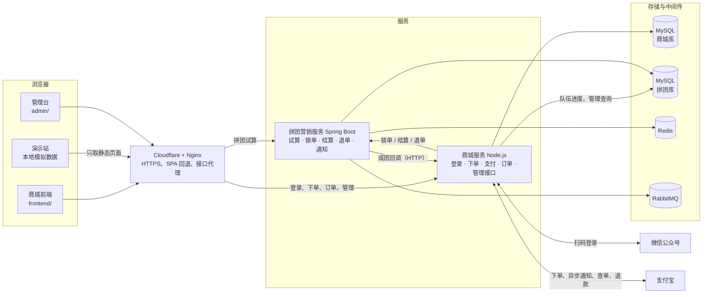
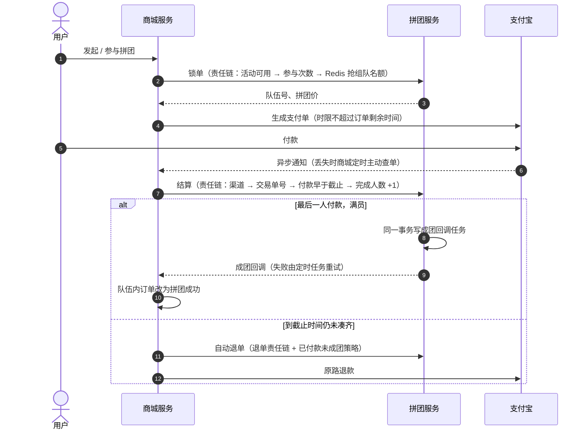

# 玩集 TOYSPACE：潮玩拼团营销系统

以《火影忍者》《咒术回战》手办为展品的拼团商城（演示项目，非官方销售渠道）。项目由四部分组成：

- **拼团营销服务**：Spring Boot + DDD 分层的后端，负责拼团活动试算、锁单、结算、退单和回调通知。
- **商城服务**（`mall/`）：Node.js + TypeScript，负责微信扫码登录、支付宝支付、用户订单和退款，并为管理台提供接口。
- **商城前端**（`frontend/`）：Vue 3 + TypeScript，覆盖首页、商品详情、登录、订单和购买反馈，适配电脑和手机。
- **管理台**（`admin/`）：维护商品、拼团活动和优惠，查看队伍与订单，调整运行开关，处理回调通知。

| 线上地址 | 说明 |
| --- | --- |
| https://shop.openrelayx.cc/ | 商城：微信登录、支付宝沙箱付款、真实拼团链路 |
| https://shop.openrelayx.cc/demo/ | 演示站：本地模拟数据，不需要登录和付款即可走完整流程 |
| https://shop.openrelayx.cc/admin | 管理台 |

### 三分钟看懂后端：透视模式

打开 **https://shop.openrelayx.cc/demo/?xray=1** （不用登录、不用付款）。页头「透视」开关打开后，右侧面板会随你的每一步操作列出后端的处理链：

- 看商品价格：接口限流 → 规则树 `RootNode → SwitchNode → MarketNode → TagNode → EndNode` 试算拼团价；
- 发起 / 参与拼团：锁单责任链 `ActivityUsabilityRuleFilter → UserTakeLimitRuleFilter → TeamStockOccupyRuleFilter`，Redis 原子自增抢组队名额防超卖；
- 付款：结算责任链 `SCRuleFilter → OutTradeNoRuleFilter → SettableRuleFilter → EndRuleFilter`，满员写回调任务并通知商城，失败定时重试；
- 退单 / 到期未成团：退单责任链 + 三种退单策略，MQ 回补名额，支付宝原路退款。

每条都附对应的 Java 类或商城服务文件，请求和返回数据可展开查看（令牌、签名、用户标识已脱敏）。演示站的请求在浏览器本地模拟，真实站（需微信登录）面板里是真实请求。

拼团查询接口对外开放：

```bash
curl -X POST https://shop.openrelayx.cc/api/v1/gbm/index/query_group_buy_market_config \
  -H 'Content-Type: application/json' \
  -d '{"userId":"u001","source":"s01","channel":"c01","goodsId":"JJ-01"}'
```

## 功能

**用户侧**

- 商品按《火影忍者》《咒术回战》分类，支持按角色、作品、系列搜索。
- 商品详情提供单独购买、发起拼团、参与拼团三种入口，拼团列表带实时倒计时，过期或满员自动禁止参团。
- 未登录时点击购买会记住购买意图，登录后回到原页面，由用户再次确认下单。
- 首页“正在拼团”跨商品列出进行中、未满员的队伍，点进去直接参团。
- 订单页分页加载，展示支付完成、拼团成功、退款处理中、已关闭等状态；拼团订单可展开看队伍进度、成员和剩余时间。
- 待支付订单可以“去付款”继续支付，也可以取消；已付款订单可以申请退单。
- 透视模式：页头开关或 `?xray=1`，边操作边看每一步背后的后端处理链（见上文）。

**商城服务**

- 微信公众号带参二维码登录，服务端签发令牌，接口从令牌识别用户。
- 拼团下单先锁单再生成支付宝支付表单；异步通知验签后调用拼团结算，成团回调把整队订单改为拼团成功。
- 继续付款：为本人未超时的待支付订单重新生成支付单，生成前先向支付宝确认是否已经付过。
- 定时补查支付结果、关闭超时订单；付款时拼团已结束会自动原路退款，退款失败自动重试。
- 队伍到期仍未凑齐时，自动为已付款成员退单并原路退款，不需要用户手动申请。
- 订单列表附带队伍进度与成员（成员名脱敏）；首页正在拼团不足时自动补开演示队伍，真实用户可以参团补满。

**管理台**

- 商品、拼团活动、优惠规则的增删改，保存后自动清理拼团服务的配置缓存。
- 拼团队伍进度与成员、商城订单查询。
- 降级、切量、渠道黑名单、缓存、限流等动态配置，改完立即生效。
- 回调通知任务查看与重发。
- 订单全链路追踪：输入订单号，把商城库、拼团库和通知任务的记录串成一条时间线，从下单、锁单、付款、结算到成团回调或退款一目了然。

**营销服务**

- 拼团试算：支持直减、满减、折扣、N 元购四种优惠，按人群标签决定活动是否可见、可参与。
- 锁单：校验活动有效期、用户参与次数上限，使用 Redis 占用组队库存，防止超卖。
- 结算：校验渠道黑名单、外部交易单号和交易时间，凑齐人数后更新成团状态。
- 退单：按“未支付 / 已支付未成团 / 已成团”分别处理，释放名额并通知下游。
- 通知：成团和退单结果通过 RabbitMQ 或 HTTP 回调通知，失败的通知任务由定时任务补偿。
- 运行保障：动态配置中心控制降级和切量，接口按用户限流并支持黑名单。

## 技术栈

| 层 | 技术 |
| --- | --- |
| 前端 | Vue 3、TypeScript、Vite、Vue Router、Pinia、原生 Fetch、自定义 CSS |
| 商城服务 | Node.js、TypeScript、Fastify、mysql2、ioredis、alipay-sdk |
| 测试 | Vitest、Vue Test Utils、Playwright |
| 后端 | Java 8、Spring Boot 2.7、MyBatis、MySQL 8 |
| 中间件 | Redis（Redisson）、RabbitMQ |
| 设计框架 | xfg-wrench：规则树、责任链、动态配置中心 |
| 运维 | Docker Compose、Nginx、Prometheus、Grafana、ELK |

## 架构



一笔拼团订单的完整链路：



后端按 DDD 分为六个模块：

| 模块 | 职责 |
| --- | --- |
| `group-buy-market-api` | 对外接口定义与 DTO |
| `group-buy-market-app` | 启动入口、配置、MyBatis 映射 |
| `group-buy-market-domain` | 领域层：`activity` 活动试算、`trade` 交易（锁单、结算、退单、通知任务）、`tag` 人群标签 |
| `group-buy-market-infrastructure` | 仓储、DAO、Redis、事件发布、外部网关、动态配置 |
| `group-buy-market-trigger` | HTTP 接口、定时任务、MQ 监听 |
| `group-buy-market-types` | 通用枚举、异常、响应码 |

## 核心设计

- **试算规则树**：`Root → Switch → Market → Tag → End` 逐层处理参数校验、降级切量、优惠计算和人群过滤；商品和活动信息用多线程并行加载。
- **交易责任链**：锁单、结算、退单各自是一条过滤链，每个校验点是一个独立节点，新增规则只需增加节点。
- **退单策略**：三种订单状态对应三种退单策略，由状态直接路由，不写条件分支。
- **库存与幂等**：组队名额在 Redis 中原子占用，外部交易单号保证重复下单返回同一笔订单。
- **可靠通知**：通知任务先落库，再异步发送，失败后由定时任务重试。
- **拼团有效期**：开团时按活动配置的分钟数计算截止时间，且不超过活动结束时间。

商城服务侧：

- **身份**：接口只认服务端签发的 HMAC 令牌，不信任请求体里的用户 ID。
- **防重复下单**：同一用户同一商品的下单请求串行处理，15 分钟内未付款的订单直接复用，不重复锁单。
- **支付跳转**：支付宝支付单用 GET 表单跳转（跨站 POST 会带上商城的 Origin，被网关拒绝），前端校验表单地址在允许列表内。
- **最终一致**：异步通知验签后结算；通知丢失时定时任务主动查单；结算被拒（付款晚于截止）自动原路退款；退款失败保持“退款处理中”并重试。
- **付款时限**：支付宝侧的付款时限不超过商城订单剩余时间，避免商城已关单、支付宝还能付款。
- **到期退款**：队伍过截止时间 1 分钟后仍未凑齐，自动退单退款；留出的宽限避免和临界时刻的成团结算冲突。

## 快速开始

### 只看前端（无需后端）

需要 Node.js 20.19 或更高版本。

```bash
cd frontend
npm install
npm run dev
```

打开 http://localhost:5173，页面顶部显示“演示模式”。用体验账号登录后，就可以完整走一遍购买和退单流程，数据保存在浏览器本地。

### 启动后端

1. 启动 MySQL、Redis 和 RabbitMQ，建表脚本在 `docs/dev-ops/mysql/sql`，容器启动时会自动执行：

   ```bash
   cd docs/dev-ops
   docker compose -f docker-compose-environment.yml up -d
   ```

2. 按本地环境修改 `group-buy-market-app/src/main/resources/application-dev.yml` 里的数据库、Redis、RabbitMQ 连接信息。Compose 把 MySQL 映射到宿主机 `13306` 端口，配置文件里默认写的是 `3306`，需要对齐。
3. 构建并启动，服务默认监听 `8091`：

   ```bash
   mvn clean package -DskipTests
   java -jar group-buy-market-app/target/group-buy-market-app.jar
   ```

### 服务器部署

用 Docker Compose 部署拼团服务、商城服务和中间件，Nginx 托管商城、演示站和管理台。开通微信登录与支付宝支付的步骤、管理台账号、更新与检查方法见 [deploy/README.md](deploy/README.md)。

### 前端对接后端

复制 `frontend/.env.live.example` 为 `frontend/.env.live.local`，填写服务地址、渠道和商品 SKU 映射，然后执行 `npm run dev:live`。变量说明、接口列表和 Nginx 部署方式见 [frontend/README.md](frontend/README.md)。

## 测试

```bash
cd frontend
npm run typecheck   # TypeScript 检查
npm test            # 53 个单元测试：请求封装、真实接口适配、演示数据流程、弹窗键盘操作、透视模式（脱敏、事件推断）
npm run test:e2e    # 10 个端到端测试：购买与退单流程、透视模式，375 / 768 / 1440 三种宽度无溢出

cd ../mall
npm test            # 37 个单元测试：下单、继续付款、支付、结算、成团、退款、到期自动退款，令牌与接口鉴权

cd ../admin
npm test            # 订单全链路时间线：单买、拼团中、成团回调成功与失败、结算被拒、到期退款、超时关闭

# 服务器上：对真实拼团服务跑一遍完整交易链路
# 开团 → 队伍有效期 → 继续付款 → 付款结算 → 参团成团 → 成团回调 → 满员拒绝 → 退单 → 到期未成团自动退款
sudo bash /opt/toyspace-backend/integration-test.sh
```

## 目录

```
.
├── frontend/                          商城前端
├── admin/                             管理台
├── mall/                              商城服务
├── group-buy-market-api/              接口定义
├── group-buy-market-app/              启动与配置
├── group-buy-market-domain/           领域层
├── group-buy-market-infrastructure/   基础设施层
├── group-buy-market-trigger/          触发层
├── group-buy-market-types/            通用类型
├── deploy/                            服务器部署：Docker Compose、Nginx
└── docs/
    ├── dev-ops/                       Docker Compose、Nginx、MySQL、监控配置
    └── tag/                           各阶段版本的部署文件
```
