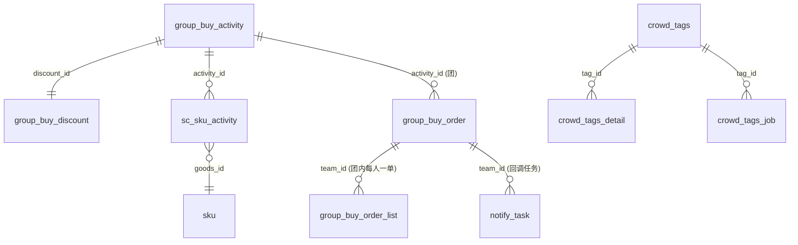
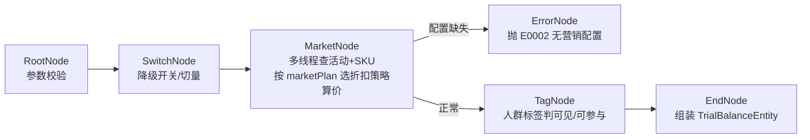
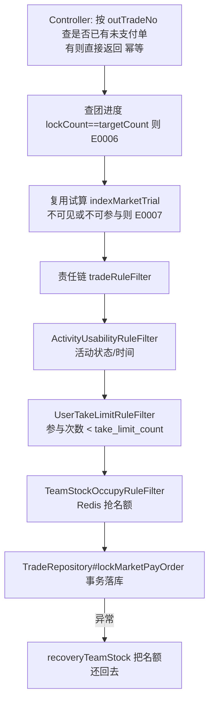
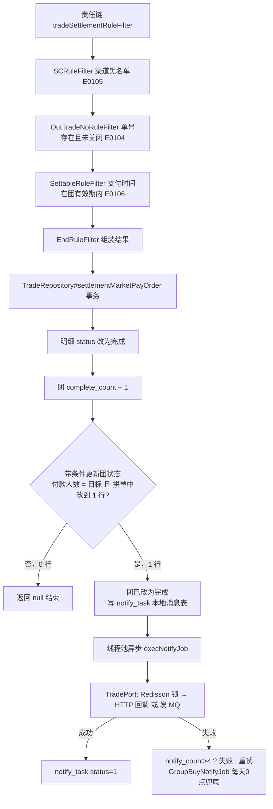
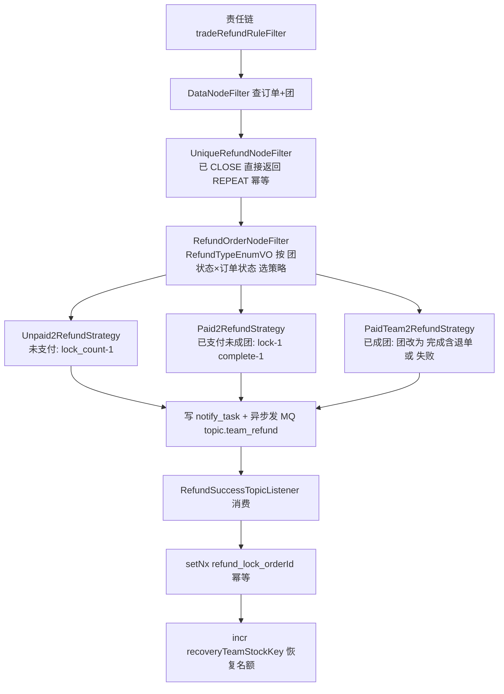

# 拼团营销系统（group-buy-market）项目解析与面试指南

> 这份文档面向「第一次接触这个项目、准备把它写进简历」的读者。
> 全文只讲项目里**真实存在**的东西，每个类名、方法名、表名都能在代码里找到。
> 建议阅读顺序：第一章 → 第三章 → 第六章，先建立整体印象，再啃流程，最后背题。

---

## 目录

1. [一句话认识这个项目](#一一句话认识这个项目)
2. [项目怎么分层（DDD 四层 + 六模块）](#二项目怎么分层ddd-四层--六模块)
3. [四条核心业务流程](#三四条核心业务流程)
4. [技术亮点：简历可写的点](#四技术亮点简历可写的点)
5. [简历怎么写](#五简历怎么写)
6. [面试问答（35 题）](#六面试问答35-题)
7. [项目已知的坑与可改进点](#七项目已知的坑与可改进点)
8. [口语化答题稿（20 题）](#八口语化答题稿20-题)
9. [模拟面试（18 题）](#九模拟面试18-题)
10. [附录](#附录)

---

## 一、一句话认识这个项目

### 1.1 它是做什么的

想象你在拼多多买东西：

1. 打开商品页，看到「单买 100 元，拼团 90 元」。
2. 你点「发起拼团」或者「参与别人的团」，系统给你**锁一个名额**。
3. 你付款。付完款系统记一笔「这个团又多了一个已付款的人」。
4. 人凑齐了，系统通知商城：「这个团成了，可以发货」。
5. 没凑齐、或者你申请退款，系统把你的名额**退回去**，让别人还能进来。

本项目就是上面这套逻辑的**后端服务**。它不是一个完整的商城，而是一个**营销中台**：商城（作者的另一个工程 `s-pay-mall-ddd-market`）通过 HTTP 接口调用它，它负责「算折扣价、锁名额、记结算、通知成团、处理退单」，**不负责支付本身**。

### 1.2 对外提供的 5 个接口

| 接口 | 作用 | 谁调用 |
|---|---|---|
| `POST /api/v1/gbm/index/query_group_buy_market_config` | 首页营销试算：算出折后价、正在进行的团、统计数据 | 商城商品页 |
| `POST /api/v1/gbm/trade/lock_market_pay_order` | 锁单：开新团或加入已有团，占一个名额 | 商城下单时 |
| `POST /api/v1/gbm/trade/settlement_market_pay_order` | 结算：支付成功后通知本系统，人齐了就成团并回调 | 商城支付成功回调 |
| `POST /api/v1/gbm/trade/refund_market_pay_order` | 退单：用户退款，退回名额 | 商城退款时 |
| `GET /api/v1/gbm/dcc/update_config?key=&value=` | 动态配置热更新（降级、切量、黑名单） | 运维/管理员 |

### 1.3 技术栈一览（只列真实用到的）

| 分类 | 技术 | 在项目里干什么 |
|---|---|---|
| 框架 | Spring Boot 2.7.12，Java 8，Maven 多模块 | 基础骨架 |
| 持久层 | MyBatis（XML Mapper）+ MySQL 8 + HikariCP | 10 张业务表 |
| 缓存 / 分布式 | Redisson 3.26 | 分布式锁、`incr/decr` 抢库存、`RBitSet` 人群标签、动态配置的发布订阅 |
| 消息队列 | RabbitMQ（Topic 交换机） | 成团通知、退单后恢复库存 |
| HTTP 调用 | OkHttp3 | 成团后 HTTP 回调商城 |
| 缓存 | Redis（Guava 仅配置、未使用） | 活动和折扣配置先查 Redis 再查数据库；Guava 本地缓存只声明了 Bean，代码里没有用到 |
| 定时任务 | Spring `@Scheduled` + Redisson 锁 | 回调补偿、超时未支付自动退单 |
| 设计框架 | 作者自研 `xfg-wrench` 组件 | 责任链、策略树、`@DCCValue` 动态配置、`@RateLimiterAccessInterceptor` 限流 |
| 可观测 | logback + Logstash（ELK）、Actuator + Prometheus + Grafana | 日志与监控 |
| 部署 | Docker Compose（MySQL、Redis、RabbitMQ、ELK、Grafana、Nginx） | 一键环境 |

**特别提醒（面试防翻车）**：项目里**没有** xxl-job、Dubbo、RocketMQ、Nacos、Spring Cloud、分库分表组件、Lua 脚本。简历上千万别写这些。

---

## 二、项目怎么分层（DDD 四层 + 六模块）

### 2.1 用「餐厅」理解六个模块

DDD（领域驱动设计）听起来很玄，其实就是「把代码按职责分开放」。把系统想成一家餐厅：

| 模块 | 餐厅角色 | 放什么 |
|---|---|---|
| `group-buy-market-api` | 菜单 | 对外接口定义 `IMarketTradeService` 等 + 请求/响应 DTO。别的系统只需要引入这个包就知道怎么调用 |
| `group-buy-market-trigger` | 服务员 | 接收外部请求：HTTP Controller、MQ 消费者（Listener）、定时任务（Job） |
| `group-buy-market-domain` | 厨师 | **核心业务逻辑**：试算、锁单、结算、退单。只定义「需要什么数据」的接口，不关心数据从哪来 |
| `group-buy-market-infrastructure` | 采购员 | 实现 domain 定义的接口：查数据库（DAO）、操作 Redis、发 MQ、调 HTTP |
| `group-buy-market-types` | 公共餐具 | 通用枚举（`ResponseCode`）、异常（`AppException`）、常量 |
| `group-buy-market-app` | 餐厅本身 | 启动类 `Application`、所有配置类（线程池、Redis、OkHttp、Guava）、`application-*.yml`、Mapper XML、测试用例 |

### 2.2 依赖方向与「依赖倒置」

```
app → trigger → domain → types
app → infrastructure → domain
trigger → api
```

关键点：**domain 不依赖 infrastructure**。domain 里只有接口（比如 `ITradeRepository`），infrastructure 里是实现（`TradeRepository`）。这叫依赖倒置：厨师说「我要一条鱼」，不关心采购员是去菜市场还是超市买的。好处是换数据库、换 Redis，厨师的代码一行不改。

### 2.3 三个子领域

domain 层按业务切成三块，路径在 `group-buy-market-domain/src/main/java/cn/bugstack/domain/` 下：

| 子领域 | 目录 | 做什么 |
|---|---|---|
| `activity` | 营销活动 | 优惠试算（策略树）、四种折扣计算、人群标签判断 |
| `trade` | 交易 | 锁单、结算、退单（三条责任链）、回调任务 |
| `tag` | 人群标签 | 把用户打上标签，写入 DB + Redis 位图 |

每个子领域内部又固定分为：`model`（实体 entity / 值对象 valobj / 聚合 aggregate）、`service`（业务逻辑）、`adapter`（对外依赖的接口：repository 仓储、port 端口）。

### 2.4 关键类速查表

| 职责 | 类 | 路径（相对模块 src/main/java/cn/bugstack/） |
|---|---|---|
| 首页试算接口 | `MarketIndexController` | trigger/http/ |
| 交易三接口 | `MarketTradeController` | trigger/http/ |
| 试算入口 | `IndexGroupBuyMarketServiceImpl` | domain/activity/service/ |
| 试算策略树节点 | `RootNode` `SwitchNode` `MarketNode` `TagNode` `EndNode` `ErrorNode` | domain/activity/service/trial/node/ |
| 折扣策略 | `ZJCalculateService` `MJCalculateService` `ZKCalculateService` `NCalculateService` | domain/activity/service/discount/impl/ |
| 锁单 | `TradeLockOrderService` + `filter/` 三个过滤器 | domain/trade/service/lock/ |
| 结算 | `TradeSettlementOrderService` + `filter/` 四个过滤器 | domain/trade/service/settlement/ |
| 退单 | `TradeRefundOrderService` + 三个策略 | domain/trade/service/refund/ |
| 回调任务 | `TradeTaskService` | domain/trade/service/task/ |
| 仓储实现（最核心） | `TradeRepository`（约 700 行）、`ActivityRepository`、`TagRepository` | infrastructure/adapter/repository/ |
| 回调出口 | `TradePort` | infrastructure/adapter/port/ |
| Redis 封装 | `RedissonService` | infrastructure/redis/ |
| 动态配置 | `DCCService` | infrastructure/dcc/ |
| MQ 生产 | `EventPublisher` | infrastructure/event/ |
| HTTP 回调 | `GroupBuyNotifyService` | infrastructure/gateway/ |
| 定时任务 | `GroupBuyNotifyJob` `TimeoutRefundJob` | trigger/job/ |
| MQ 消费 | `TeamSuccessTopicListener` `RefundSuccessTopicListener` | trigger/listener/ |

### 2.5 十张表的关系



用人话说：

- **活动配置**：`group_buy_activity`（活动：目标人数 `target`、有效时长 `valid_time`、参与次数上限 `take_limit_count`、人群标签 `tag_id`）+ `group_buy_discount`（折扣：`market_plan` 是 ZJ/MJ/ZK/N 四选一，`market_expr` 是表达式如 "100,10"）+ `sc_sku_activity`（哪个渠道的哪个商品挂了哪个活动）+ `sku`（商品原价）。
- **交易**：`group_buy_order` 是「一个团」，关键字段 `team_id`、`target_count` 目标人数、`lock_count` 已锁单人数、`complete_count` 已付款人数、`status`（0 拼单中 / 1 完成 / 2 失败 / 3 完成含退单）。`group_buy_order_list` 是「团里每个人的一单」，关键字段 `order_id` 本系统单号、`out_trade_no` 商城单号、`status`（0 锁定 / 1 完成 / 2 退单）。
- **回调**：`notify_task` 是本地消息表，记录「该通知谁、通知了几次、成功没」。
- **人群**：`crowd_tags` 标签、`crowd_tags_detail` 标签下有哪些用户、`crowd_tags_job` 打标任务。

三个 ID 的区别（高频问题）：`team_id` 是团的编号；`order_id` 是本系统给每个参团者生成的单号；`out_trade_no` 是商城传过来的外部单号，用来做幂等。

---

## 三、四条核心业务流程

### 3.1 流程一：营销试算（策略树）

**场景**：用户打开商品页，系统要回答「这个人、这个商品，拼团价多少？他能不能看到、能不能参加？」

**入口**：`MarketIndexController#queryGroupBuyMarketConfig` → `IndexGroupBuyMarketServiceImpl#indexMarketTrial`



每个节点做的事：

1. **RootNode**：userId、goodsId、source、channel 任一为空就抛 `ILLEGAL_PARAMETER`。
2. **SwitchNode**：问 `DCCService` 两件事。降级开关打开就抛 `E0003`（比如大促时整体关闭拼团）；`cutRange` 切量，按 `userId.hashCode() % 100` 决定这个用户是否在放量范围内，不在就抛 `E0004`（灰度发布用）。
3. **MarketNode**：这是核心。
   - 先执行 `multiThread()`：用线程池同时跑两个 `FutureTask`，一个查活动+折扣配置，一个查 SKU 原价，各自最多等 5 秒（`timeout=5000`），结果放进 `DynamicContext` 上下文。两个查询互不依赖，并行能省一半时间。
   - 再执行 `doApply()`：拿折扣配置里的 `marketPlan`（"ZJ"/"MJ"/"ZK"/"N"）去 `Map<String, IDiscountCalculateService>` 里取对应策略 Bean，调用 `calculate()` 算出支付价，顺便算出优惠额 = 原价 − 支付价。
4. **TagNode**：活动没配 `tagId` 就全放行。配了，就去 Redis 位图查这个用户在不在人群里，结合 `tagScope`（1 = 限制可见，2 = 限制参与）得出 `isVisible` 和 `isEnable` 两个布尔值。
5. **EndNode**：把原价、优惠、支付价、目标人数、可见性打包成 `TrialBalanceEntity` 返回。

**四种折扣策略**（都继承 `AbstractDiscountCalculateService`，这是模板方法：先做人群过滤，再调子类的 `doCalculate`）：

| marketPlan | 类 | 表达式示例 | 算法 |
|---|---|---|---|
| ZJ 直减 | `ZJCalculateService` | "10" | 原价 − 10，最低 0.01 |
| MJ 满减 | `MJCalculateService` | "100,10" | 原价 ≥ 100 才减 10，否则原价 |
| ZK 折扣 | `ZKCalculateService` | "0.85" | 原价 × 0.85，抹掉小数 |
| N 元购 | `NCalculateService` | "9.9" | 直接返回 9.9 |

如果折扣的 `discountType` 是 TAG（人群限定优惠），用户不在人群里就**不打折**直接返回原价。

### 3.2 流程二：锁单（责任链 + Redis 抢库存）

**场景**：用户点「参团」，要给他占一个名额，但一个 3 人团绝不能进来第 4 个人。

**入口**：`MarketTradeController#lockMarketPayOrder` → `TradeLockOrderService#lockMarketPayOrder`



**责任链三个过滤器**（在 `TradeLockRuleFilterFactory` 里用 `LinkArmory` 串起来，任一节点返回非 null 或抛异常就终止）：

1. `ActivityUsabilityRuleFilter`：活动状态必须是「生效」（`E0101`），当前时间必须在起止时间内（`E0102`）。
2. `UserTakeLimitRuleFilter`：查这个用户在此活动已经参与几次，≥ `take_limit_count` 就拒绝（`E0103`）。
3. `TeamStockOccupyRuleFilter`：`teamId` 为空说明是开新团，跳过；否则调 `TradeRepository#occupyTeamStock` 抢 Redis 名额，失败抛 `E0008`。

**Redis 抢名额算法**（`TradeRepository#occupyTeamStock`，面试必问）：

```java
Long recoveryCount = redisService.getAtomicLong(recoveryTeamStockKey); // 退单恢复量
long occupy = redisService.incr(teamStockKey) + 1;   // +1 是因为开团人自己占了一个
if (occupy > target + recoveryCount) {
    redisService.decr(teamStockKey);                 // 超了，把加的减回去
    return false;
}
// 兜底：给这个序号再上一把 NX 锁，防止极端情况 incr 出现重复值
String lockKey = teamStockKey + "_" + occupy;
return redisService.setNx(lockKey, validTime + 60, TimeUnit.MINUTES);
```

要点：`incr` 是 Redis 原子操作，100 个人同时来，每人拿到的数字都不同，超过目标的直接失败，**天然不超卖，且不用加锁**。`recoveryTeamStockKey` 是另一个 key，记录「有人退单腾出了几个名额」，所以总容量 = 目标 + 恢复量。

**落库**（`TradeRepository#lockMarketPayOrder`，`@Transactional(timeout=500)`）：

- 开新团：生成 8 位随机 `teamId`，插入 `group_buy_order`，`lock_count=1`。
- 参团：执行 `update group_buy_order set lock_count = lock_count + 1 where team_id=? and lock_count < target_count`，影响行数不为 1 抛 `E0005`。这是数据库层的第二道防线。
- 插入 `group_buy_order_list`，`order_id` 12 位随机数，`biz_id = activityId_userId_第几次参与`。
- 任何异常都会在 service 层 catch 住，调 `recoveryTeamStock` 把 Redis 恢复量 +1，避免名额泄漏。

### 3.3 流程三：结算与成团回调（责任链 + 本地消息表）

**场景**：商城收到支付成功，通知本系统「这个人付款了」。系统要判断团是否凑齐，凑齐了要通知商城发货，而且**这个通知绝不能丢**。

**入口**：`MarketTradeController#settlementMarketPayOrder` → `TradeSettlementOrderService#settlementMarketPayOrder`



**成团判断**：加完付款人数后，直接执行一条带条件的更新：只有付款人数等于目标人数、并且团还是拼单中，才把团改成完成。改到 1 行说明是这一单凑满的，由它写回调任务；改到 0 行直接返回。判断交给数据库，不再使用事务外提前查出的付款人数（按修复后的写法）。

**可靠回调的四层保障**（面试重点）：

1. **本地消息表**：`notify_task` 的插入和「团状态改完成」在同一个事务里。要么都成功要么都失败，不会出现「团成了但没记要通知」。
2. **异步立即执行**：事务提交后，`threadPoolExecutor.execute()` 马上尝试回调，用户不用等。
3. **定时补偿**：`GroupBuyNotifyJob` 每天 0 点扫 `notify_status in (0, 2)` 的任务重试。`TradeTaskService#execNotifyJob` 里，失败超过 4 次标记为终态失败。
4. **分布式锁防重**：`TradePort#groupBuyNotify` 先 `tryLock("notify_job_lock_key_" + uuid)`，多台机器同时跑 Job 也只有一台会真的回调。

回调有两种方式，锁单时由商城通过 `notifyConfigVO` 指定：HTTP（OkHttp POST 到 `notifyUrl`）或 MQ（发到 `topic.team_success`）。

### 3.4 流程四：退单（责任链 + 策略 + MQ 最终一致）

**场景**：用户退款，或者锁单后一直没付款超时了。要把名额还回去，但退单时团可能处于不同状态，处理方式不同。

**入口**：HTTP `MarketTradeController#refundMarketPayOrder` 或定时任务 `TimeoutRefundJob`（每分钟扫超时未支付单）→ `TradeRefundOrderService#refundOrder`



**三种退单策略**由「团状态 × 订单状态」决定，写在枚举 `RefundTypeEnumVO` 里，每个枚举值自己实现 `matches()` 方法：

| 团状态 | 订单状态 | 策略 | 数据库动作 |
|---|---|---|---|
| 拼单中 | 已锁定未支付 | `Unpaid2RefundStrategy` | `lock_count - 1`，订单改退单 |
| 拼单中 | 已支付 | `Paid2RefundStrategy` | `lock_count - 1`，`complete_count - 1` |
| 已成团 | 已支付 | `PaidTeam2RefundStrategy` | 只剩 1 人则团改失败，否则改「完成含退单」；不恢复名额 |

**为什么恢复名额要走 MQ 而不是同步做**：退单的数据库事务和 Redis 操作是两个系统，同步做的话「DB 成功 Redis 失败」就不一致。改成 DB 事务内写 `notify_task` + 发 MQ，消费者失败会重投，最终一定会恢复。消费者用 `refund_lock_{orderId}` 的 `setNx` 保证同一单只恢复一次。

---

## 四、技术亮点：简历可写的点

每条按「是什么 / 为什么 / 在哪」组织，面试时可以直接展开。

**1. DDD 分层 + 依赖倒置**
domain 只定义仓储接口，infrastructure 实现。业务逻辑与技术细节隔离。位置：`domain/*/adapter/repository/I*Repository` 与 `infrastructure/adapter/repository/*Repository`。

**2. 策略树编排营销试算**
6 个节点通过 `get()` 决定下一跳，节点可插拔可重排。基于 wrench 框架的 `AbstractMultiThreadStrategyRouter`，固定「`multiThread` → `doApply` → `router`」骨架。位置：`domain/activity/service/trial/`。

**3. 三条责任链**
锁单 3 节点、结算 4 节点、退单 3 节点，用 `LinkArmory` 装配成 `BusinessLinkedList`，任一节点返回非 null 即短路。新增校验只需加一个 Filter 类并注册到工厂。位置：`domain/trade/service/*/factory/`。

**4. 策略模式 + Spring Map 注入**
`@Resource Map<String, IDiscountCalculateService>`，Spring 自动把所有实现按 Bean 名装进 Map，用 `marketPlan` 当 key 取策略，零 if-else。退单策略同理。新增折扣类型只需加一个 `@Service("XX")` 类。

**5. 枚举 + 抽象方法替代 if-else**
`RefundTypeEnumVO` 每个枚举常量实现 `matches(团状态, 订单状态)`，`getRefundStrategy()` 用 stream 找第一个匹配的。

**6. 多线程并行加载**
`MarketNode#multiThread` 用 `FutureTask` + 线程池并行查活动和 SKU，5 秒超时。另有 `MarketNode2CompletableFuture` 用 `CompletableFuture.allOf` 的对照实现（默认关闭）。线程池参数：核心 20、最大 50、队列 5000、`CallerRunsPolicy`。

**7. Redis 无锁化抢库存**
`incr` 原子自增 + 超限 `decr` 回退 + 恢复量 key + 每序号 `setNx` 兜底。数据库再加一道 `where lock_count < target_count`。

**8. Redis BitMap 人群标签**
`TagRepository#addCrowdTagsUserId` 把用户写 DB 并 `RBitSet.set(MD5(userId) % Integer.MAX_VALUE, true)`；`ActivityRepository#isTagCrowdRange` 用 `bitSet.get(index)` 判断。一亿用户只占约 12MB。

**9. 本地消息表 + 定时补偿 + 分布式锁 = 可靠回调**
`notify_task` 与业务同事务 → 线程池异步立即执行 → `GroupBuyNotifyJob` 兜底 → 最多重试 5 次 → Redisson 锁防多实例重复。

**10. MQ 解耦 + 消费幂等**
退单后发 `topic.team_refund`，`RefundSuccessTopicListener` 消费时 `setNx` 防重，失败抛异常让 MQ 重投。

**11. DCC 动态配置热更新**
`@DCCValue("downgradeSwitch:0")` 等四个开关，通过 Redis 发布订阅广播到所有实例，`DCCController` 一个 GET 请求就能秒级降级、切量、拉黑渠道、关缓存。

**12. 接口限流与降级**
`MarketIndexController` 上 `@RateLimiterAccessInterceptor(key="userId", permitsPerSecond=1.0, blacklistCount=1, fallbackMethod=...)`，按用户限流，超限走降级方法返回 `RATE_LIMITER`。

**13. 多层幂等**
锁单按 `out_trade_no` 查未支付单，外加 `order_id` 唯一键兜底；结算靠「状态为未付款」的条件更新，重复结算改到 0 行回滚；退单 `UniqueRefundNodeFilter` 看订单状态；MQ 消费 `refund_lock_{orderId}`。注意：`notify_task.uuid` 实际建的是普通索引，`biz_id` 没有唯一索引，这两处不能算幂等保障。

**14. 可观测与部署**
`TraceIdFilter` 给每个请求埋 traceId 进 MDC，日志经 Logstash 进 ES；Actuator 暴露 Prometheus 指标；`docs/dev-ops` 下 Docker Compose 一键拉起全部中间件。

---

## 五、简历怎么写

### 5.1 项目名称与一句话

**拼团营销系统（Group Buy Market）** —— 基于 DDD 架构的电商拼团营销中台，为商城提供拼团优惠试算、锁单、结算成团、退单全链路能力。

### 5.2 模板 A：校招 / 实习版（突出理解与基础扎实）

- 采用 DDD 四层架构（trigger / domain / infrastructure / types）与 Maven 多模块组织代码，领域层通过接口定义仓储，基础设施层实现，做到业务逻辑与技术细节解耦。
- 使用策略树模式编排营销试算流程（参数校验 → 降级切量 → 折扣计算 → 人群标签 → 结果组装），结合策略模式 + Spring Map 注入实现直减、满减、折扣、N 元购四种折扣算法的动态路由。
- 基于责任链模式实现锁单、结算、退单三条校验链，新增规则只需新增节点类，无需改动主流程。
- 利用 Redis `incr` 原子操作实现拼团名额无锁化抢占，配合数据库条件更新双重防超卖；使用 Redis BitMap 实现人群标签的低成本存储与判断。
- 通过本地消息表 + 线程池异步 + 定时任务补偿 + Redisson 分布式锁，保证成团回调通知的可靠投递；退单后通过 RabbitMQ 异步恢复名额，消费端 `setNx` 保证幂等。

### 5.3 模板 B：1-3 年经验版（突出高并发与一致性设计）

- 负责拼团交易域设计与实现，包含锁单、结算、退单全链路，日常通过 DCC 动态配置实现秒级降级、灰度切量与渠道黑名单。
- 设计 Redis 无锁库存抢占方案：`incr` 自增 + 超限 `decr` 回退 + 独立恢复量 key + 序号级 `setNx` 兜底，在极端运维场景下仍不超卖；数据库 `lock_count < target_count` 条件更新作为最终防线。
- 采用本地消息表模式解决成团回调的分布式事务问题，通知任务与业务变更同事务落库，异步执行 + 每日定时补偿 + 5 次重试上限 + 分布式锁防多实例重复投递。
- 退单场景基于「团状态 × 订单状态」枚举策略路由三种退单逻辑，通过 RabbitMQ 实现库存恢复的最终一致性，消费幂等基于 Redis `setNx`。
- 试算链路通过 `FutureTask` + 自定义线程池并行加载活动配置与商品数据，接口按用户维度限流并提供降级 fallback；接入 ELK 日志链路追踪与 Prometheus/Grafana 监控。

### 5.4 模板 C：突出设计模式与工程能力

- 在营销试算中落地「规则树 + 模板方法」：抽象路由类固定「异步预加载 → 业务处理 → 路由下一节点」骨架，各节点只关注自身逻辑。
- 在交易域落地「责任链 + 策略 + 工厂」：三条责任链由工厂类统一装配，退单策略由带抽象方法的枚举匹配，消除大量 if-else。
- 折扣计算采用模板方法，父类统一处理人群标签过滤，子类只实现算法；四种折扣类型通过 Spring 按 Bean 名注入的 Map 动态选择。
- 编写覆盖试算、锁单、结算、退单、库存恢复、人群标签的集成测试用例，并提供 Docker Compose 一键部署环境。

### 5.5 写简历的三条红线

1. **不写没有的东西**：没有分库分表、xxl-job、Dubbo、RocketMQ、Lua 脚本。面试官问「分库分表按什么键」你答不上来会很难看。
2. **不写「参与」两个字**：写「负责 / 设计 / 实现」，然后确保自己真的能讲清楚。
3. **每一条都要能回答「为什么这么做」**：见第六章。

---

## 六、面试问答（35 题）

每题给「核心答案」（30 秒到 1 分钟能说完）和「可深挖」。

### A. 基础理解（8 题）

**Q1. 这个项目是做什么的？**
核心答案：一个拼团营销中台。商城调它算拼团价、锁名额，支付成功后调它结算，人凑齐了它回调商城成团，用户退款它退回名额。本身不管支付，只管「拼团这件事」。
可深挖：为什么要拆成中台？营销规则变化快，和交易解耦后可以独立迭代、独立扩容。

**Q2. 一次完整的拼团，接口调用顺序是什么？**
核心答案：商品页调「试算」拿折后价 → 下单调「锁单」占名额并拿到 `orderId` → 用户在商城支付 → 商城支付回调后调「结算」→ 若是最后一人，系统通过 HTTP 或 MQ 回调商城成团 → 中途退款调「退单」。

**Q3. 为什么要分 DDD 四层？直接 Controller-Service-DAO 不行吗？**
核心答案：三层架构里 Service 往往又依赖 DAO 又写业务，改数据库就要动业务代码。DDD 让 domain 只依赖自己定义的接口，infrastructure 去实现，方向倒过来了。业务逻辑集中在 domain，测试时可以 mock 仓储。
可深挖：实体、值对象、聚合的区别。项目里 `GroupBuyOrderAggregate` 把用户、活动、折扣三个实体打包，作为锁单事务的边界。

**Q4. `group_buy_order` 和 `group_buy_order_list` 什么关系？**
核心答案：前者是「团」，一行一个团，记目标人数、已锁单数、已付款数、团状态。后者是「团里每个人的订单」，一行一个人，用 `team_id` 关联。

**Q5. `team_id`、`order_id`、`out_trade_no` 分别是什么？**
核心答案：`team_id` 团编号，锁单开团时 8 位随机生成；`order_id` 本系统给每个参团者的单号，12 位随机，有唯一索引；`out_trade_no` 商城的订单号，用来对账和幂等。

**Q6. `lock_count` 和 `complete_count` 有什么区别？**
核心答案：`lock_count` 是占了名额的人数（包括没付款的），`complete_count` 是付了款的人数。锁单加 `lock_count`，结算加 `complete_count`，`complete_count` 达到 `target_count` 才算成团。

**Q7. 试算时怎么判断用户能不能参加活动？**
核心答案：三道关。活动没配人群标签就全放行；配了标签就查 Redis 位图看用户在不在人群里；再看 `tag_scope` 配置是限制「可见」还是限制「参与」，算出 `isVisible` 和 `isEnable`。锁单接口发现任一为 false 就拒绝。

**Q8. 定时任务有哪些？为什么需要？**
核心答案：两个。`GroupBuyNotifyJob` 每天 0 点扫描没回调成功的 `notify_task` 重试，兜底保证通知不丢。`TimeoutRefundJob` 每分钟扫锁单后超时未支付的订单，自动退单释放名额，避免名额被占死。
可深挖：多实例部署时怎么防止两台机器同时跑？用 Redisson `tryLock`，拿不到锁的直接跳过。

### B. 设计模式（7 题，口语版）

这一组是口语化版本，可以直接说出口。面试里这七题通常会合并成三个大回答：

| 面试官问 | 你说哪几段 |
|---|---|
| 「你项目用了哪些设计模式？」 | 第 9 题开头，再带上第 11 题 |
| 「策略模式怎么用的？」 | 第 10 题，结尾接第 13 题 |
| 「责任链怎么用的？」 | 第 9 题的责任链部分，结尾接第 14 题 |

第 12 题留着讲退单流程时用，第 15 题留着被追问试算细节时用。第 13、14 题是扩展类题目，一定要练到能脱口而出，最能区分「背过设计模式」和「真用过设计模式」。

**Q9. 策略树和责任链有什么区别？项目里分别用在哪？**

> 最本质的区别是能不能分叉。
>
> 责任链是一条直线。几个校验步骤提前排好顺序，挨个往下走，每一步做完就交给下一步，中间哪一步有了结论或者报错，整条链就停了。路线是固定的。
>
> 策略树是每一步自己决定下一步去哪，可以根据情况走不同的分支。比如试算的时候，有一步是查活动配置，查到了就继续去算人群限制，没查到就直接走报错的那条路。
>
> 所以一串按顺序做的检查用责任链，有条件分支的流程用策略树。项目里试算用的是策略树，锁单、结算、退单这三个都用的责任链。

**Q10. 系统怎么根据配置找到对应的折扣算法？**

> 折扣有四种，直减、满减、打折、N 元购，每种是一个单独的类，但都遵守同一个规范。
>
> 我给每个类起了个短名字，就叫 ZJ、MJ 这种，跟数据库里活动配置填的值一样。
>
> 项目启动的时候，Spring 会自动把这四个类按名字收集到一个字典里。算价格的时候，拿配置里填的值当钥匙，去字典里一取，就拿到对应的算法了，完全不用写一堆判断。

**Q11. 模板方法用在哪？**

> 模板方法的意思是，父类把做事的步骤顺序定死，子类只负责填其中某一步的具体内容。项目里主要有三处。
>
> 第一处是折扣计算。父类规定先检查用户在不在人群范围里，不在就不打折，在的话再去算价格。四种折扣的子类只管写自己怎么算价格，人群检查这步不用重复写。
>
> 第二处是试算的节点。框架规定每个节点先并行加载数据，再做业务处理。像营销那个节点，就在加载数据那步同时查活动配置和商品信息，查完再去算优惠。
>
> 第三处是查缓存。有个公共方法规定先查缓存，查不到再查数据库，查到了顺手写回缓存。具体查数据库的那段逻辑由调用的地方传进来。

**Q12. 退单为什么用枚举来选策略？**

> 退单要看两个状态，团的状态和订单的状态，组合出三种情况，每种处理方式不一样。
>
> 如果用判断语句写，就是两个条件交叉嵌套，越写越乱，以后加一种情况还要在中间插一段，很容易改错。
>
> 所以我把三种退单类型做成三个枚举值，每个枚举值自己写一段判断，说明自己负责哪种状态组合。选策略的时候把三个挨个问一遍，谁说是我的就用谁。
>
> 这样每种情况的判断跟它自己的定义放在一起，一眼就能看懂。新加一种情况只要加一个枚举值，选的那段逻辑完全不用动。

**Q13. 如果要新增一种「买一送一」折扣，改哪些地方？**

> 只要做两件事。
>
> 第一，新写一个折扣计算的类，继承那个折扣父类，给它起个名字，比如叫 BY，然后在里面只写买一送一怎么算价格就行。人群检查那些公共逻辑父类已经做了，不用管。
>
> 第二，在数据库的折扣配置里，把营销方式那一栏填成 BY。
>
> 其他地方一行都不用改。因为项目启动时会自动把新类收集进那个按名字查找的字典里，算价格的地方拿到 BY 就能找到它。这就是开闭原则，对扩展开放，对修改关闭。

**Q14. 如果锁单要加一个「黑名单用户拦截」，怎么加？**

> 锁单的校验是一条责任链，所以加一个新的校验节点就行。
>
> 第一步，新写一个校验类，按照链上节点的统一规范来写。里面判断这个用户在不在黑名单里，在的话直接报错，不在就交给下一个节点。
>
> 第二步，找到装配锁单这条链的工厂类，把这个新节点加进去。位置我会放在最前面，因为查黑名单最便宜，先把黑名单用户挡掉，后面查活动、查参与次数、抢名额这些操作就都省了。
>
> 黑名单数据可以放在动态配置里，这样运营想拉黑谁，改一下配置就立刻生效，不用发版。
>
> 原来那三个节点完全不用动。

**Q15. 试算的 6 个节点之间怎么连起来的？**

> 每个节点里都有一个专门的方法，作用就是告诉框架下一个节点是谁。节点之间是互相注入的，比如营销节点里同时持有标签节点和报错节点。
>
> 每个节点干完自己的活，就调用框架提供的一个跳转方法，框架先问这个节点下一个是谁，再去执行下一个节点。
>
> 六个节点依次是：参数校验、开关拦截、营销计算、人群标签、组装结果，还有一个异常节点只在查不到配置时才走。
>
> 这样设计的好处是加节点很方便。比如想在开关后面加一个风控检查，只要改开关节点让它的下一个指向风控节点，风控节点再指向营销节点就行。

### C. 并发与分布式（10 题，口语版）

这一组是口语化版本，可以直接说出口。面试里这十题通常会以下面几个大问题的形式出现：

| 面试官问 | 你说哪几段 |
|---|---|
| 「怎么防止超卖？」 | 第 16 题，被追问再接 17、18 |
| 「项目里分布式锁用在哪？」 | 第 21 题，被追问再接 20 |
| 「遇到过什么并发问题？」 | 第 19 题 |
| 「多线程和线程池怎么用的？」 | 第 23 题，再接 22 |

第 16 和 19 题出现概率最高，一定练熟。第 24、25 题相对少见，第 25 题最后那段「单机限流」是加分点，能说出来说明你真看懂了实现。

**Q16. 用缓存自增抢名额，为什么不会超卖？**

> 抢名额用的是 Redis 的自增命令。Redis 处理命令是排队一条一条执行的，自增这个动作一次做完，中间插不进别人。所以一百个人同时来，拿到的数字一定是一到一百各不相同，就像银行叫号机吐号。
>
> 每个人拿到号之后跟团的目标人数比，超了就说明轮不到他，直接拒绝。这样最多只有目标人数那么多人能通过，而且整个过程不用加锁，性能很好。
>
> 被拒的人，我会把刚才加上去的那个数再减回去。不然计数器会一直虚高，后面有人退单腾出位置也进不来。

**Q17. 已经用自增了，为什么还要再加一把锁？**

> 这是一个兜底设计。理论上自增不会给两个人同一个号，但作者在代码注释里写了，生产上遇到过 Redis 集群配置出问题、或者运营改错数据，导致号码重复的情况。
>
> 所以拿到号之后，再用这个号当名字设一个标记，这个操作的规则是名字不存在才能设成功。万一真有两个人拿到同一个号，第二个人设不成功，就被挡住了。
>
> 标记的有效期是拼团时长再多加一个小时，多留一会儿是为了出问题时方便排查。

**Q18. 退单恢复名额，为什么要单独用一个计数器？**

> 因为那个号码计数器是只增不减的。每个号上面都挂着刚才说的那个标记，如果退单时直接把计数器减一，下一个人再自增就会拿到一个已经用过的号，撞上还没过期的标记，反而进不来。
>
> 所以退单腾出的名额单独记在另一个计数器里。判断能不能进的时候，上限是目标人数加上恢复的数量，相当于把天花板抬高，号码继续往上走，永远不会重复。

**Q19. 结算时判断是不是最后一个付款的人，有什么并发问题？怎么解决？**

> 结算时要判断是不是最后一个付款的人。原来的写法是在代码里拿提前查出来的付款人数做减法，两个人同时付最后两单时会都读到旧值，结果人数凑满了团却没成功。
>
> 我把它改成让数据库判断：在同一个事务里，先给付款人数加一，然后执行一条更新团状态的语句，条件是付款人数等于目标人数、并且团还是拼单中。改成功了说明是我这一单凑满的，由我去写回调通知；改到零行就直接返回。
>
> 这样能保证正确，是因为更新语句会锁住这一行，两个人会排队执行，而且排到的人读的是最新值，只有真正把人数凑满的那一次条件成立。

**Q20. 分布式锁抢锁时传的几个参数是什么意思？**

> 抢锁的时候传了三个参数：最多等多久、拿到锁以后多久自动释放、时间单位。
>
> 每天零点那个回调补偿任务，用的是最多等三秒、自动释放时间填零。填零在我们用的这个 Redis 客户端版本里表示不设固定过期时间，改成开启看门狗：默认三十秒过期，只要任务还在跑就自动续期，跑完主动释放。好处是任务执行多久不确定，锁也不会提前失效。
>
> 每分钟跑的超时退单任务不一样，填的是六十秒，到时间自动释放，不续期。

**Q21. 多台机器部署，定时任务怎么保证只跑一次？**

> 项目是多实例部署的，每台机器上的定时任务到点都会触发。所以任务一开始先去 Redis 抢一把固定名字的锁，抢到的那台执行，抢不到的直接跳过。
>
> 执行完在最后释放锁。释放之前会先确认这把锁确实是自己当前线程持有的，避免把别的机器的锁给释放了。
>
> 成团回调也是一样的思路，每条通知任务发之前都按任务的唯一标识抢锁，防止几台机器同时捞到同一条，重复通知商城。

**Q22. 并行查数据时，某个查询超时了会怎样？**

> 试算的时候，活动配置和商品信息是交给线程池同时查的，取结果时每个最多等五秒。
>
> 超过五秒没回来就会抛超时异常，这个异常一路往外抛，接口返回失败。这样一个慢查询不会把整个请求一直挂住、占着服务器的线程不放。
>
> 项目里还留了另一种写法的版本，能把多个异步任务编排在一起、统一处理异常，更灵活。默认没启用，作者在注释里把两种写法的优缺点做了对比。

**Q23. 线程池参数怎么配的？拒绝策略选的什么？**

> 核心线程二十、最大线程五十、队列长度五千，拒绝策略是让提交任务的那个线程自己去执行。
>
> 选这个拒绝策略，是因为试算和成团回调这些任务都不能丢。线程池和队列都满了的时候，不直接丢弃也不报错，而是让调用方自己跑。调用方被占住了，自然就提交得慢，起到削峰的效果。
>
> 这套配置我觉得有两处可以优化。一是队列五千太大，线程池是先把队列塞满才会扩到最大线程数，所以最大线程五十基本用不上。二是空闲线程的存活时间配的是五千，单位是秒，一个多小时，偏长了，可以按实际情况调小。

**Q24. 事务注解里配的超时时间是什么单位？**

> 是秒。锁单那个方法写的是五百，结算写的是五千，换算下来一个是八分多钟，一个是一个多小时，其实都很长。
>
> 所以它起不到快速失败的作用，更像是防止事务因为死锁之类的原因无限挂着的兜底。如果真想快速失败，应该配到几秒的级别。

**Q25. 试算接口是怎么限流的？**

> 试算接口上加了一个限流注解，按用户来限，每个用户每秒只放一个请求。
>
> 底层是给每个用户单独配一个令牌桶，放在本地缓存里。桶里每秒生成一个令牌，请求来了拿得到令牌就放行，拿不到就拦截，走提前写好的降级方法，返回「请求太频繁」。
>
> 另外还有黑名单：一个用户被拦的次数超过设定值，就被拉进黑名单二十四小时，这段时间他的请求直接走降级。限流本身也有总开关，挂在动态配置上，出问题可以一键关掉。
>
> 有一点要注意，令牌桶和黑名单都存在每台机器自己的内存里，所以是单机限流。部署三台机器，一个用户实际每秒能过三次。要做全局限流，得把计数放到 Redis 里。

### D. 可靠性与一致性（6 题，口语版）

这一组是口语化版本，可以直接说出口。面试里通常以下面几个大问题的形式出现：

| 面试官问 | 你说哪几段 |
|---|---|
| 「怎么保证通知不丢？」 | 第 26 题，再接 27 |
| 「幂等怎么做的？」 | 第 29 题，被追问消息重复再接 28 |
| 「为什么用消息队列？」 | 第 30 题 |
| 「锁单了不付款怎么办？」 | 第 31 题 |

第 26、27 题是「通知不丢」的一整套，建议连着说。第 29 题最后那段是你读代码发现的问题，是加分点。

**Q26. 本地消息表为什么要和业务写在同一个事务里？**

> 成团的时候要做两件事：把团改成成功，再记一笔「要通知商城」。这笔记录就是本地消息表里的一行。
>
> 如果两件事分开做，可能团已经改成功了，写通知记录那一步却失败了，商城就永远收不到通知。反过来也可能记了要通知，团却没改成功，商城收到一个假的成团消息。
>
> 放在同一个事务里，要么都成功，要么都回滚。只要团成了，通知记录就一定在，后面就算发送失败，也能靠重试把它补上。

**Q27. 通知商城失败了怎么办？**

> 事务提交后会马上用线程池发一次。成功就把记录标成已完成；失败就把尝试次数加一，标成待重试。
>
> 待重试的记录由一个定时任务捞出来重发，每次最多捞五十条。代码里的规则是：前五次失败都继续重试，第六次还失败就标成最终失败，需要人工处理。
>
> 这里有个可以优化的地方：这个补偿任务每天零点才跑一次，失败一次要等到第二天才重试，五次重试最长要拖好几天。实际项目里应该改成几分钟跑一次，重试间隔再逐步拉长。

**Q28. 消息被重复消费了怎么办？**

> 消息队列为了保证不丢，可能会把同一条消息投递好几次，所以消费的地方必须做到处理多次和处理一次效果一样。
>
> 退单恢复名额的消费者，处理前先用订单号在 Redis 里设一个标记，规则是不存在才能设成功。设成功说明是第一次，往下恢复名额；设不成功说明处理过了，直接跳过。
>
> 如果处理到一半出错，会先把这个标记删掉再抛异常。这样消息队列重新投递时还能进来，不会因为标记残留而永远被跳过。

**Q29. 项目里的幂等是怎么做的？**

> 按接口来说。
>
> 锁单：一进来先拿商城的订单号查，已经有一笔没付款的单，就直接把原来的结果返回，不会再占一次名额。本系统生成的订单号上还有唯一索引兜底。
>
> 结算：先查这笔订单，已经关闭的直接拦掉；把订单改成已付款的那条语句带着「状态还是未付款」的条件，重复结算会改到零行，事务回滚。
>
> 退单：责任链第二个节点看订单状态，已经退过的直接返回「重复请求」。消息消费：用订单号在 Redis 里设标记，设过的就跳过。
>
> 有两个地方是我读代码时发现不严谨的。一是通知表的唯一标识，索引名字叫唯一索引，建表时其实建的是普通索引，重复插入拦不住。二是限制用户参与次数的那个业务编号，代码里靠唯一索引冲突来防重，但表上根本没给它建唯一索引。

**Q30. 退单为什么不直接同步恢复 Redis 里的名额？**

> 因为退单要改两个地方：数据库里的人数和 Redis 里的名额。这是两套系统，没法放在一个事务里。
>
> 如果同步做，可能数据库已经提交了，Redis 那一步网络抖一下失败了，这个名额就永远丢了，后面的人补不进来。
>
> 所以改成在数据库事务里同时写一条待发消息，提交后发到消息队列，由消费者去恢复名额。消费失败消息队列会重投，最终一定能恢复上。代价是有几秒的不一致，这个业务能接受。
>
> 我本地没装消息队列的时候正好看到了这个中间状态：数据库人数减了，Redis 名额没恢复，新用户参不进来，查通知表那条消息是待重试。

**Q31. 用户锁单后一直不付款，名额会一直被占着吗？**

> 不会。锁单的时候会给这笔订单记一个截止时间，就是锁单时间加上活动配置的有效时长，项目里配的是十五分钟。
>
> 有个定时任务每分钟跑一次，找出还没付款、已经过了截止时间的订单，逐条走退单流程，把占位人数减掉，名额还回去。
>
> 因为是多实例部署，任务开始前会先抢一把分布式锁，抢到的那台才执行。另外它每次最多处理十条，超时订单特别多的时候会积压，可以调大数量或者循环处理到没有为止。

### E. 扩展与追问（4 题，口语版）

这一组是开放性问题，考的是你对项目的整体把握。对应的大问题：

| 面试官问 | 你说哪几段 |
|---|---|
| 「并发量上来了怎么办？」 | 第 32 题 |
| 「数据量大了怎么办？」 | 第 33 题 |
| 「缓存怎么用的？」 | 第 34 题 |
| 「这个项目有什么可以改进的？」 | 第 35 题 |

第 35 题面试收尾时几乎必问，一定准备好。第 32、34 题说出缓存的实际情况，比泛泛地说「加缓存」有说服力得多。

**Q32. 如果访问量上来了，哪里最先扛不住？怎么优化？**

> 最先扛不住的是首页试算接口，它流量最大，每打开一次商品页就调一次。
>
> 这个接口里活动和折扣配置已经放了 Redis 缓存，但商品信息、渠道商品配置还是每次查数据库。另外它还要查进行中的团列表和活动统计，统计是对订单表做计数，数据一多会很慢。
>
> 优化的话，商品和渠道配置变动少，也放进缓存；团列表和统计数据不需要实时，可以定时算好放 Redis，接口直接读。
>
> 锁单那边抢名额走 Redis 很快，压力主要在写数据库，量特别大时可以考虑按活动分散热点，或者把落库改成异步。

**Q33. 如果要分库分表，按什么来分？**

> 项目现在是单库单表，没做分库分表，但代码里有预留。退单相关的几条语句都特意带上了用户编号，注释里写着企业里通常按用户编号做路由。
>
> 按用户编号分的好处是，同一个用户的订单都落在同一个库，查「我的拼团」不用跨库。
>
> 麻烦的是团的维度。一个团里的人会分散在不同的库，按团号查整个团的成员就要跨库。一般的做法是再建一张按团号查的索引表，或者把团的汇总数据冗余一份。

**Q34. 缓存在项目里是怎么用的？**

> 主要缓存的是活动配置和折扣配置。有一个公共的查询方法，先查 Redis，查不到再查数据库，查到后写回 Redis。
>
> 缓存有个开关挂在动态配置上，Redis 出问题时改一下配置就能直接走数据库，不用发版。
>
> 读代码时我注意到两个问题。一是写缓存时没设过期时间，运营改了活动配置，缓存里还是旧的，得手动删。应该加上过期时间，或者改配置时主动删缓存。二是项目里配了一个本地缓存的组件，但实际上没有任何地方用到它。

**Q35. 让你改进这个项目，你会改什么？**

> 我挑几个读代码时发现、改了收益比较大的。
>
> 第一个我已经改了：结算时判断最后一个付款的人用的是旧值，两个人同时付款会导致团凑满了却没成功，我改成了让数据库带条件更新来判断。
>
> 第二个是通知补偿任务每天零点才跑一次，失败了要隔天才重试，应该改成分钟级，重试间隔逐步拉长。
>
> 第三个是发 HTTP 回调的客户端没设连接和读取超时，商城那边一卡住，会把我们的线程一直拖着。
>
> 第四个是限流数据存在每台机器自己的内存里，多实例部署时总量会翻倍，要做全局限流得放到 Redis 里。
>
> 还有几个小问题，比如退单防重标记的过期时间单位写错了、业务编号和通知表缺唯一索引，这些改起来都很快。


---

## 七、项目已知的坑与可改进点

面试时主动说出这些，能证明你真读过代码，而不是背了一遍教程。

| # | 问题 | 位置 | 怎么改 |
|---|---|---|---|
| 1 | 成团判断原来用事务外提前查出的付款人数做减法，最后两人同时付款会都读到旧值，人数凑满了团却没成功（重复成团已被条件更新和事务回滚挡住） | `TradeRepository#settlementMarketPayOrder` 第 3 步 | **已修复**：成团更新语句加上 `complete_count = target_count` 条件，在付款人数加一之后、同一事务里执行，改成功的那一单负责写回调通知 |
| 2 | 并发重复锁单会占两个名额。接口层靠「先用外部单号查、查不到再插入」防重，两个并发请求都查不到就都会成功；外部单号没有唯一索引，本系统订单号又是随机生成的，数据库也拦不住。同样原因，用户参与次数限制在并发下也能被绕过 | `MarketTradeController#lockMarketPayOrder` 与 `group_buy_order_list` 建表语句 | 给 `(user_id, out_trade_no)` 建唯一索引，让第二条插入直接失败回滚；或者在接口入口按外部单号抢分布式锁，让同一笔单串行 |
| 3 | 代码依赖 `biz_id` 触发 `DuplicateKeyException` 做限购幂等，但建表语句里 `biz_id` 没有唯一索引 | `2-29-group_buy_market.sql` 的 `group_buy_order_list` | 给 `biz_id` 加唯一索引 |
| 4 | 退单幂等锁 `setNx(lockKey, 30*24*60*60*1000L, TimeUnit.MINUTES)`，数值按毫秒算却传了分钟单位，实际过期远超 30 天 | `TradeRepository#refund2AddRecovery` | 改为 `30, TimeUnit.DAYS` |
| 5 | `isCacheOpenSwitch()` 返回 `"0".equals(...)`，即 0 = 开启缓存，与字段注释「1 关闭」容易误读 | `DCCService` | 改名或改语义 |
| 6 | `spring.rabbitmq.port: 15672` 是管理台端口，AMQP 应该是 5672 | `application-dev.yml` | 改端口 |
| 7 | `application-prod.yml` 与 dev 完全相同，生产配置带明文密码和内网 IP | app 模块 resources | 用环境变量注入 |
| 8 | `OkHttpClient` 没有设置连接 / 读写超时，回调方挂了会拖住线程 | `OKHttpClientConfig` | 加 `connectTimeout`、`readTimeout` |
| 9 | `RabbitMQConfig` 的 `@Configuration` 被注释，交换机和队列靠 Listener 上的 `@QueueBinding` 自动声明 | app 模块 config | 生产环境建议显式声明 |
| 10 | `ZKCalculateService` 用 `setScale(0, RoundingMode.DOWN)` 抹掉小数，注释却写「四舍五入」，和 ZJ/MJ 保留小数不一致 | domain 折扣实现 | 统一保留两位并用 HALF_UP |
| 11 | `TimeoutRefundJob` 注释写「每 5 分钟」，cron 实际是每分钟 | trigger/job | 改注释或改 cron |
| 12 | 线程池队列 5000 太大，最大线程数 50 几乎永远用不上 | `ThreadPoolConfig` | 队列改小或用 `SynchronousQueue` 视场景而定 |
| 13 | 人群标签 `tag` 子域只有测试入口，`TagService` 里用户列表是硬编码，生产无调度 | domain/tag | 接数仓或加 Job |

---

## 八、口语化答题稿（20 题）

第六章是知识点自测，这一章是**可以直接说出口的逐字稿**。所有难念的英文都换成了中文说法，按五个接口分组。标「必背」的六题请一字不差地熟记，其余理解思路即可。

用法：对着稿子念三遍，然后合上页面复述一遍。能自然说完不卡壳，这题就过了。每段控制在 30 秒到 1 分钟。

### 一、试算接口（4 题）

`index/query_group_buy_market_config`

**01. 为什么试算要单独做一个接口，锁单里不是也算了一遍吗**

> 因为这是两个不同的时刻。试算是用户刚打开商品页的时候，他就看一眼价格，可能看完就走了，这个接口访问量特别大，而且它不写任何数据，纯查询。锁单是用户真的决定要买了，这时候要往数据库写东西。两者放一起的话，一是流量对不上，商品页的量可能是下单量的几十倍；二是我没法单独给查询这一路做限流和缓存。所以拆开更合适。

**02. 试算的价格和锁单时的价格不一致怎么办**

> 以锁单时候重新算的那个价为准，因为那个才是真正写进订单的。用户看到价格到他真正点下单，中间可能隔了很久，这期间活动可能已经过期了，或者运营改了配置。所以锁单接口里我会重新走一遍试算，拿最新的结果。如果这时候发现活动已经失效了，就直接把这单拦掉，告诉商城活动不可用。

**03. 为什么只有这个接口做了限流**

> 主要是三个原因。第一，它的流量最大，商品页谁都能刷。第二，它是纯查询，被刷了不会产生脏数据，但会把数据库打满，影响到真正要下单的用户。第三，另外几个接口本身有业务约束，比如锁单必须先有商品有活动，结算必须真的付过款，天然刷不起来。所以我们只在这一个接口上按用户维度做了限流，超了就走降级，直接返回一个提示，不打数据库。

**04. 试算里为什么要开多线程**

> 因为试算要拿两份数据，一份是活动和折扣的配置，一份是商品的原价，这两个查询互相不依赖。串行的话要等两次数据库往返，并行只等一次，接口响应能快将近一半。我们是用线程池提交两个任务，然后分别去取结果，每个都设了五秒超时，避免某一个查询卡住把整个请求拖死。

### 二、锁单接口（5 题）

`trade/lock_market_pay_order`

**05. 怎么保证一个三人团不会进来第四个人** 「必背」

> 这块我们做了两道防线。第一道在缓存上。用户来参团的时候，我先在缓存里对这个团的计数器做一次自增。自增是原子的，所以哪怕一百个人同时点，每个人拿到的数字都不一样，是一二三四这样排下去的。我拿这个数字跟团的目标人数比，超了就说明轮不到他，我把刚才加的再减回去，然后告诉他名额没了。第二道在数据库。就算缓存万一出问题放进来了，我更新数据库的时候会带一个条件，只有当前占位人数小于目标人数才让更新。如果这条更新影响的行数是零，我就直接抛异常回滚。

**06. 开团和参团有什么区别** 「必背」

> 商城调锁单接口的时候会传一个团号过来。如果传的是空的，说明这个人要自己开一个新团，那我就随机生成一个团号，往数据库插一条新的团记录，占位人数直接记成一。这种情况不用去抢名额，因为团是他开的，第一个位置天然就是他的。如果传过来有值，说明他要加入别人已经开好的团，那就必须先去缓存里抢名额，抢到了才能往下走。

**07. 商城超时重试，同一笔订单会不会占两个名额** 「必背」

> 商城那边会传一个他们自己的订单号过来。我接口一进来什么都不干，先拿这个订单号去数据库查一下，看看是不是已经有一条还没付款的记录了。如果有，说明这个请求之前已经成功过了，只是商城没收到响应，那我就把上次的结果原样返回给他，不会再占一次名额。另外我给订单号加了唯一索引，万一并发下两条都插进来了，第二条会直接报错，也能兜住。

**08. 名额抢到了但数据库写入失败，名额会漏掉吗**

> 不会。业务代码里，抢名额和写数据库这一整段是包在一个异常捕获里的。一旦写库出问题抛异常了，我会在捕获的地方调一个恢复方法，把这个团的恢复量计数器加一。下一个人来抢的时候，可用总数是目标人数加上这个恢复量，所以刚才那个漏掉的位置就又放出来了。

**09. 为什么锁单还要再走一次试算**

> 试算不光是算价格，它其实也是一道校验。锁单的时候我要拿到当前真实的折后价写进订单，同时还要确认这个活动现在还有效、没过期，以及这个用户在不在活动限定的人群范围里。有些活动是只给特定人群的，展示的时候能看到但不一定能参加，所以下单这一步必须再确认一遍。

### 三、结算接口（4 题）

`trade/settlement_market_pay_order`

**10. 怎么判断自己是不是最后一个付款的人** 「必背」

> 结算时要判断是不是最后一个付款的人。原来的写法是在代码里拿提前查出来的付款人数做减法，两个人同时付最后两单时会都读到旧值，结果人数凑满了团却没成功。
>
> 我把它改成让数据库判断：在同一个事务里，先给付款人数加一，然后执行一条更新团状态的语句，条件是付款人数等于目标人数、并且团还是拼单中。改成功了说明是我这一单凑满的，由我去写回调通知；改到零行就直接返回。
>
> 这样能保证正确，是因为更新语句会锁住这一行，两个人会排队执行，而且排到的人读的是最新值，只有真正把人数凑满的那一次条件成立。

**11. 通知商城成团的请求失败了，通知会丢吗** 「必背」

> 不会丢，我们做了几层保护。首先，这条待通知的记录是跟团的状态一起写进数据库的，在同一个事务里，所以只要团成了，这条记录一定在。然后事务提交完，会用线程池立刻发一次，用户不用等。如果这次发失败了，记录会被标成待重试，有个定时任务会捞出来接着发，最多发五次，五次还不行就标成失败等人工处理。最后因为我们是多台机器部署的，怕几台同时捞到同一条记录重复发，所以发之前会去缓存里抢一把锁，抢到的那台才发。

**12. 为什么占位和付款要拆成两个接口**

> 因为中间隔着用户在商城那边付款的过程，这段时间我这边是管不到的。他可能点完参团就去干别的了，半小时后才回来付，也可能压根不付。而且占位和付款本来就是两件事，我用了两个计数器分别记，一个记有多少人占了位，一个记有多少人真掏钱了。判断团有没有成，只看掏钱的那个数。

**13. 结算接口被重复调用会怎样**

> 不会重复算。结算这条链路上第二个校验节点，会拿商城传过来的订单号去查这一单的状态。如果发现已经是完成或者已经关闭了，就直接拦下来返回，后面的加人数、发通知都不会执行。所以商城那边就算因为超时重试调了好几次，实际生效的只有第一次。

### 四、退单接口（4 题）

`trade/refund_market_pay_order`

**14. 退单为什么要分三种情况** 「必背」

> 因为退单的时候团可能处在不同阶段，能做的事不一样。第一种，人还没付款就退了，我只要把占位人数减一就行。第二种，人已经付款了但团还没凑齐，那占位人数和付款人数都得减一。第三种，团已经凑齐成功了他才来退，这种我就不能再把名额放出来了，因为团已经成立了，再放人进来会把这个事实搞乱，我只会把团标记成一个「完成但含退单」的状态。

**15. 为什么恢复名额要走消息队列，不能同步做**

> 因为退单要动两个地方，一个是数据库里的人数，一个是缓存里的名额，这是两套系统。如果我同步做，很可能数据库改完了，缓存那边网络抖一下失败了，这个名额就永远丢了，后面的人再也进不来。所以我改成数据库事务里只写一条待处理的消息，然后发到队列里，由消费方去恢复缓存。这样万一失败，队列会重新投递，最终一定能恢复上。代价是有一两秒延迟，但这个业务能接受。

**16. 消息重复消费，名额被恢复了两次怎么办**

> 消费的时候我会先拿这一单的订单号去缓存里设一个标记，用的是那种「不存在才能设成功」的操作。如果设成功了说明是第一次处理，我就往下走恢复名额。如果设失败了，说明之前已经处理过了，直接返回不做事。另外如果中间处理出错了，我会把这个标记删掉再抛异常，这样队列重新投递过来的时候还能进得来，不会因为标记还在就被永久跳过。

**17. 用户锁了名额一直不付款，名额永远被占着吗**

> 不会。锁单的时候会给这笔订单记一个截止时间，就是锁单时间加上活动配置的有效时长，项目里配的是十五分钟。
>
> 有个定时任务每分钟跑一次，找出还没付款、已经过了截止时间的订单，逐条走退单流程，把占位人数减掉，名额还回去。
>
> 因为是多实例部署，任务开始前会先抢一把分布式锁，抢到的那台才执行。另外它每次最多处理十条，超时订单特别多的时候会积压，可以调大数量或者循环处理到没有为止。

**18. 这几个接口的幂等分别怎么做的**

> 按接口来说。
>
> 锁单：一进来先拿商城的订单号查，已经有一笔没付款的单，就直接把原来的结果返回，不会再占一次名额。本系统生成的订单号上还有唯一索引兜底。
>
> 结算：先查这笔订单，已经关闭的直接拦掉；把订单改成已付款的那条语句带着「状态还是未付款」的条件，重复结算会改到零行，事务回滚。
>
> 退单：责任链第二个节点看订单状态，已经退过的直接返回「重复请求」。消息消费：用订单号在 Redis 里设标记，设过的就跳过。
>
> 有两个地方是我读代码时发现不严谨的。一是通知表的唯一标识，索引名字叫唯一索引，建表时其实建的是普通索引，重复插入拦不住。二是限制用户参与次数的那个业务编号，代码里靠唯一索引冲突来防重，但表上根本没给它建唯一索引。

**19. 让你加一个「拼团失败自动退款」，怎么设计**

> 我的思路是加一个定时任务，定期去扫那些已经过了有效期但人数还没凑齐的团。扫到之后把这个团标记成失败，然后拿到团里所有已经付过款的订单，一条条走现有的退单流程。退单流程本身已经写好了，包括减人数、发消息恢复名额，这部分可以直接复用。最后再往通知任务表里写一条记录，告诉商城这个团失败了，让他们那边去发起真正的退款。整个改动主要是加一个定时任务和一种新的通知类型，核心逻辑都是现成的。

**20. 哪个接口最容易成为性能瓶颈**

> 最先扛不住的是首页试算接口，它流量最大，每打开一次商品页就调一次。
>
> 这个接口里活动和折扣配置已经放了 Redis 缓存，但商品信息、渠道商品配置还是每次查数据库。另外它还要查进行中的团列表和活动统计，统计是对订单表做计数，数据一多会很慢。
>
> 优化的话，商品和渠道配置变动少，也放进缓存；团列表和统计数据不需要实时，可以定时算好放 Redis，接口直接读。
>
> 锁单那边抢名额走 Redis 很快，压力主要在写数据库，量特别大时可以考虑按活动分散热点，或者把落库改成异步。

### 说的时候注意三点

**先给结论再讲细节。** 每段的第一句都是结论，说完停半秒，让面试官有机会打断你追问。他不追问你再往下说。

**用「我」和「我们」，不要用「系统」。** 说「我先去缓存里抢名额」比说「系统会去缓存抢名额」更像是你亲手写的。

**不会的题别硬编。** 可以说「这块我当时没有深入看，不过按我的理解应该是」，然后讲你的思路。面试官更在意你有没有分析能力。

---

## 九、模拟面试（18 题）

这 7 题是模拟面试题，故意换了问法，还有几道场景题，用来检验是真的理解还是只背下来了。拿到题目先判断它属于哪个环节，再说答案，这样最不容易串题。

**先看这张对应表**

| 题目里出现 | 属于哪个环节 | 核心答案 |
|---|---|---|
| 参团、抢名额、团满了 | 锁单 | Redis 自增抢号，数据库条件更新兜底 |
| 最后一个付款、成团 | 结算 | 数据库带条件更新团状态 |
| 通知商城、发货 | 回调 | 本地消息表、立即发送、定时补偿 |
| 重复请求、发了两次 | 幂等 | 按接口分别防重 |

**第一轮（7 题）**

### 1. 先用两分钟左右介绍一下你这个项目。

环节：**项目整体**　要点：业务一段、技术一段、亮点一段，最后留一个钩子让面试官顺着问。

**这样说**

> 这是一个拼团营销中台，商城通过接口调用它来实现拼团功能。它只管拼团，不管支付。主要有四个环节：用户看商品时算拼团价，下单时锁名额，付款后结算，人凑齐了通知商城发货，退款时把名额退回去。
>
> 技术上用的是 Spring Boot，按 DDD 分层，数据库是 MySQL，缓存和分布式锁用 Redis，异步通知用消息队列。
>
> 我觉得比较有意思的有三块。第一是抢名额，用 Redis 自增来做，不用加锁也不会超卖。第二是成团通知，用本地消息表加定时补偿保证不丢。第三是设计模式，试算用了策略树，交易环节用了责任链。
>
> 另外我读代码时发现结算有一个并发问题，两个人同时付最后两单会导致团凑满了却没成功，我自己把它修掉了。

### 2. 你项目里用了哪些设计模式？策略树和责任链有什么区别？

环节：**设计模式**　要点：每个模式都要说出用在哪、解决什么问题，区别要举例子。

**这样说**

> 主要用了三个。
>
> 责任链用在锁单、结算、退单。比如锁单前要依次检查活动有没有生效、用户参与次数有没有超、名额够不够，我把这几个检查串成一条链，挨个走，哪一步不通过就拦下。新加一个检查只要加一个节点。
>
> 策略模式用在折扣计算。有直减、满减、打折、N 元购四种，每种是一个独立的类，根据活动配置自动选。退单也用了，按团和订单的状态选三种处理方式之一。
>
> 模板方法是配合用的，比如折扣的父类规定先检查人群、再算价格，子类只写怎么算价格。
>
> 策略树和责任链最大的区别是能不能分叉。责任链是提前排好顺序的一条直线；策略树是每个节点自己决定下一步去哪。比如试算的时候，营销节点查到了活动配置就去算人群限制，没查到就直接走报错节点。所以一串顺序检查用责任链，有分支的流程用策略树。

### 3. 一个三人团只剩最后一个名额，两个用户同时点了参团，系统是怎么保证只进来一个人的？

环节：**锁单**　要点：这题问的是锁单抢名额，不是结算时判断最后一个付款的人，别串题。

**例子**

三人团已有张三（开团，占第 1 个位置）和李四（2 号），Redis 计数器是 1，只剩一个名额。王五和赵六同时点参团。

| 顺序 | 王五 | 赵六 | 计数器 |
|---|---|---|---|
| 1 | 自增拿到 2，算出自己是第 3 个 |   | 2 |
| 2 |   | 自增拿到 3，算出自己是第 4 个 | 3 |
| 3 | 3 没超过目标 3，通过，登记「3 号已占」 |   | 3 |
| 4 |   | 4 超过目标 3，拒绝，把自己加的数减回去 | 2 |

结果：王五进来，赵六收到名额不足。就算 Redis 出问题把赵六也放了进来，数据库「占位人数小于目标人数」的条件也会让他改到 0 行、参团失败。

**这样说**

> 靠两道防线。
>
> 第一道在 Redis。参团的时候先对这个团的计数器做一次自增，自增是原子的，两个人同时来一定拿到不同的号。拿到号之后跟目标人数比，超了就拒绝，并且把刚才加的数减回去。三人团只剩一个名额，所以只有一个人能通过。
>
> 拿到号之后还会用这个号设一个「不存在才能设成功」的标记，作为兜底，防止极端情况下号码重复。
>
> 第二道在数据库。写库时给团的占位人数加一，条件是占位人数小于目标人数。万一 Redis 放多了人，这条语句会改到零行，直接抛异常。

**追问：如果王五退单了，王七进来会怎样？**

| 事件 | 发生了什么 | 计数器 | 恢复数 | 上限 |
|---|---|---|---|---|
| 王五退单 | 数据库占位人数 3 → 2；消息被消费后恢复数加一。计数器不减，「3 号已占」标记还在 | 2 | 1 | 3 + 1 = 4 |
| 王七参团 | 自增拿到 3，算出第 4 个，4 没超过 4，登记「4 号已占」，通过 | 3 | 1 | 4 |
| 王八参团 | 自增拿到 4，算出第 5 个，超过 4，拒绝并减回 | 3 | 1 | 4 |

> 王五退单后，数据库里他的订单改成已关闭，团的占位人数减一，同时写一条消息。消息被消费后，给这个团的恢复数加一。计数器本身不减，王五那个号的标记也还在。
>
> 王七来参团，自增后算出自己是第 4 个，这时上限是目标人数 3 加上恢复数 1，等于 4，所以能通过，用的是新的 4 号，不会跟王五的标记冲突。
>
> 如果退单时直接把计数器减回去，王七会拿到 3 号，撞上王五还没过期的标记，明明有空位也进不来，所以才单独用一个恢复数。
>
> 注意只有团还没成立时退单才会加恢复数，团已经成立就不恢复。另外如果消息没送到，恢复数暂时没加，王七会暂时进不来，等消息重试送达就好了。

### 4. 接着上一题：假如抢到名额的那个人，后面写数据库的时候失败了，这个名额会怎样？

环节：**锁单**　要点：名额不是留给这个人，而是还回去给别人。别和通知重发混在一起。

**这样说**

> 不会丢。抢名额和写数据库这一整段包在一个异常捕获里，写库失败时会调一个恢复方法，给这个团的恢复计数器加一。
>
> 判断能不能进的上限是目标人数加上恢复数，所以上限被抬高了一格，刚才那个位置就重新放出来，下一个人能补进来。
>
> 之所以不直接把号码计数器减回去，是因为这个人拿到号时已经设过标记了，号码往回拨会让下一个人撞上这个标记。

### 5. 团凑满之后要通知商城发货，你怎么保证这个通知一定能送到？

环节：**回调**　要点：最关键的是第一层：通知记录和团状态在同一个事务里写，没有它后面的重试无从谈起。

**这样说**

> 靠三层保证。
>
> 第一层是本地消息表。团改成成功和写一条「要通知商城」的记录，放在同一个事务里，要么都成功要么都回滚。只要团成了，通知记录一定在。
>
> 第二层是立即发加定时补偿。事务提交后马上用线程池发一次，成功就标成已完成，失败就把次数加一、标成待重试。定时任务会把待重试的捞出来重发，前五次失败继续重试，第六次还失败标成最终失败，人工处理。
>
> 第三层是防重复。多台机器可能同时捞到同一条记录，所以每条发之前先抢一把分布式锁，抢到的才发。
>
> 这里还有一个可以改进的地方：补偿任务每天零点才跑一次，失败了要隔天才重试，应该改成分钟级。

### 6. 用户付完款，商城因为网络超时，连续给你发了两次结算请求，系统会发生什么？

环节：**幂等**　要点：要说清楚第二次在哪一步被挡住、为什么付款人数不会加两次。

**例子**

三人团，张三、李四已经付款（付款人数 2）。王五付款后，商城用同一个订单号 M003 连发了两次结算请求。

| 步骤 | 第一次请求 | 第二次请求 |
|---|---|---|
| 校验链 | 订单存在、未关闭、支付时间有效，通过 | 订单存在，已付款不算关闭，也通过 |
| 订单改成已付款（条件：状态还是未付款） | 改 1 行 | 状态已经是已付款，改 0 行，抛异常，事务回滚 |
| 付款人数加一 | 2 → 3 | 没执行 |
| 成团更新 | 改 1 行，写一条通知 | 没执行 |

最终：付款人数 3，团已完成，通知记录只有 1 条。两个请求就算真正同时到，改同一笔订单时也会被行锁排队，后面那个一样改到 0 行回滚。

**这样说**

> 第一次请求正常结算：订单改成已付款，团的付款人数加一，如果凑满了就写一条成团通知。只是响应没回到商城。
>
> 第二次同样的请求进来，校验环节会放过它，因为订单存在、也没关闭。但进到事务里，把订单改成已付款的那条语句带着「状态还是未付款」的条件，这时订单已经是已付款了，改到零行，直接抛异常，整个事务回滚，后面加人数和写通知都不会执行。所以付款人数不会被加两次，也不会重复通知商城。
>
> 就算两个请求同时到，改同一笔订单时数据库行锁会让它们排队，后面那个一样改到零行回滚。
>
> 这里有一点可以改进：第二次返回的是失败，商城可能以为没结算成功还会继续重试。更好的做法是像锁单那样，发现已经结算过就直接返回上次的成功结果。

### 7. 如果让你改进这个项目，你会改哪些地方？

环节：**开放题**　要点：面试收尾几乎必问，挑三四个说清楚就够，第一个说自己已经动手改过的。

**这样说**

> 我挑几个读代码时发现、改了收益比较大的。
>
> 第一个我已经改了：结算时判断最后一个付款的人用的是旧值，两个人同时付款会导致团凑满了却没成功，我改成了让数据库带条件更新来判断。
>
> 第二个是通知补偿任务每天零点才跑一次，失败了要隔天才重试，应该改成分钟级，重试间隔逐步拉长。
>
> 第三个是发 HTTP 回调的客户端没设超时，商城那边一卡住，会把我们的线程一直拖着。
>
> 第四个是限流数据存在每台机器自己的内存里，多实例部署时总量会翻倍，要做全局限流得放到 Redis 里。

**第二轮（8 题）**：换了角度，加入了人群标签、动态配置、多线程、分层追问等方向，其中第 11 题和第一轮的第 3 题很像，但问的是不同环节。

### 8. 用户看到拼团价 90 元，犹豫了半小时才下单。这半小时里运营把活动改成了直减 30，他下单时按哪个价格算？

环节：**试算 + 缓存**　要点：先答「以锁单时重新试算为准」，再说出这个项目缓存没过期的实际问题，这是加分点。

**这样说**

> 理论上以下单那一刻重新算出来的价格为准。商品页展示的价格只是给用户看的，锁单接口里会再走一次试算，把当时算出来的价格写进订单。
>
> 但这个项目有个实际问题：活动和折扣配置放在 Redis 缓存里，写缓存时没设过期时间，运营改了数据库之后也没有任何地方去删缓存。所以改成直减 30 之后，服务读到的还是缓存里的旧配置，用户下单仍然按 90 算，一直到缓存被手动删掉、服务重启，或者把缓存开关关掉才会变。
>
> 如果运营是把活动改成过期或者失效，那锁单时的校验会拦住，返回活动不可用，这个跟缓存无关。
>
> 要改的话，给配置缓存加一个过期时间，或者在后台改配置时主动把对应的缓存删掉。

### 9. 假设活动只对新用户开放，系统怎么判断一个用户是不是新用户？为什么不直接查数据库？

环节：**人群标签**　要点：答出位图 + 哈希取下标，再说清为什么不查库；最后补一句位图不存在时放行。

**这样说**

> 用的是 Redis 的位图。打标任务会把符合条件的用户写进数据库的明细表，同时在位图里把这个用户对应的位置设成 1。判断的时候，把用户 ID 做一次哈希取模得到一个下标，直接取那一位是 0 还是 1。
>
> 不直接查数据库有两个原因。一是快，位图判断就是一次内存操作，数据库要走索引查询，而试算接口每打开一次商品页就调一次，量很大。二是省，一亿用户的位图大概只占十几兆内存，明细表存一亿行要大得多。数据库那份明细还留着，用来对账和排查。
>
> 有个细节：如果这个标签的位图在 Redis 里不存在，代码是直接放行的，属于宽松策略，避免标签数据还没准备好就把所有人挡在外面。

### 10. 大促当天拼团服务扛不住了，不发版不重启，你有哪些手段能立刻止血？

环节：**动态配置**　要点：按「从重到轻」说：整体降级、切量、渠道黑名单，最后补一句拦截位置的讲究。

**这样说**

> 项目里有一套动态配置，改完之后通过 Redis 的发布订阅广播到所有实例，秒级生效，不用发版也不用重启。
>
> 最直接的是降级开关，打开之后所有试算在流程第二个节点就被拦掉，请求根本不会打到数据库，相当于临时把拼团功能关掉。
>
> 温和一点的是切量开关，比如从一百调到二十，按用户 ID 哈希取模只放两成用户进来，既保住大部分流量又能降压。
>
> 还有渠道黑名单，如果是某个渠道在刷量，可以单独把这个渠道的结算拦掉。限流开关也挂在动态配置上。
>
> 另外试算接口本身就有限流，按用户每秒一个请求，超了走降级返回提示，被拦多次的用户会进二十四小时黑名单。
>
> 这些开关放的位置也有讲究，降级和切量都在试算流程很靠前的地方、查数据库之前，这样才真的起到保护作用。

### 11. 两个用户同时付了这个团的最后两单，系统会发生什么？

环节：**结算**　要点：这题问的是结算的成团判断，不是锁单抢名额，注意和第 3 题区分。

**这样说**

> 这是结算环节。两个人的结算请求各自进一个事务，第一步把自己的订单改成已付款，第二步给团的付款人数加一。加人数这条语句会锁住团的那一行，所以两个人会排队执行。
>
> 加完之后执行一条带条件的更新：付款人数等于目标人数、并且团还是拼单中，才把团改成完成。先执行的那个人加完是 2，条件不成立，改 0 行，直接返回；后执行的加完是 3，条件成立，改 1 行，由他去写回调通知。
>
> 原来的写法是拿事务外提前查出来的付款人数做减法，两个人都会读到旧值，都认为自己不是最后一个，结果人数凑满了团却没成功。这是我自己发现并修掉的问题。

### 12. 用户已经付过款、但团还没凑齐，这时他申请退款。系统要改哪些数据？

环节：**退单**　要点：三种退单里的第二种。要说清数据库改三处、Redis 走消息异步恢复。

**这样说**

> 这属于第二种退单：已支付、但团还没成。
>
> 数据库改三处：这个人的订单状态改成已退单；团的占位人数减一；团的付款人数也减一，因为他的钱之前已经算进去过了。
>
> 同时在这个事务里写一条待发消息，提交后发到消息队列。消费者收到后先用订单号设一个防重标记，然后给这个团的 Redis 恢复数加一，把名额放出来。
>
> Redis 里的号码计数器不减，因为他的号已经登记过标记了，减回去会让下一个人撞上这个标记。

### 13. 试算为什么要用多线程？如果其中一个查询很慢会发生什么？

环节：**试算**　要点：说清并行的收益，再说超时保护，最后可以带出线程池参数。

**这样说**

> 试算要拿两份数据，一份是活动加折扣的配置，一份是商品信息。这两个查询互相不依赖，所以交给线程池同时查。串行要等两次数据库往返，并行只等一次。
>
> 取结果时每个最多等五秒。超过五秒会抛超时异常，一路往外抛，接口返回失败。这样是为了不让一个慢查询把请求一直挂住、占着服务器的线程不放。
>
> 线程池是全局共用的，核心二十、最大五十、队列五千，拒绝策略是让提交任务的线程自己执行，保证任务不丢。

### 14. 你说 domain 层不依赖 infrastructure 层，那 domain 层怎么拿到数据库里的数据？

环节：**DDD**　要点：关键词是接口加依赖注入，一定要说出「编译期不依赖、运行期由容器注入」。

**这样说**

> 靠接口和依赖注入。查团、更新人数这些方法的定义写在 domain 层，是一组接口；具体怎么连数据库、怎么拼 SQL 写在 infrastructure 层，那边有实现类。
>
> 运行的时候 Spring 把实现类注入进来，domain 层拿到的是接口，根本不知道背后是 MySQL 还是别的存储。编译期 domain 不依赖 infrastructure，方向是反过来的，所以叫依赖倒置。
>
> 好处是换存储只改实现层，业务代码一行不用动；写测试的时候也可以塞一个假的实现进去，不用真连数据库。

### 15. 这个项目是单体还是微服务？多实例部署时哪些地方要特别注意？

环节：**部署**　要点：先定性，再按「互斥、共享状态、配置同步」三类说注意点，最后带一个自己踩过的坑。

**这样说**

> 是单体应用，对外只暴露 HTTP 接口，没有用微服务那一套。不过是多实例部署的，前面有 Nginx 做负载均衡，演示环境起了两个实例。
>
> 多实例要注意几点。定时任务每台机器到点都会触发，所以任务开始前要抢分布式锁，抢到的那台才执行；成团回调也一样，每条通知发之前按唯一标识抢锁，防止重复通知商城。
>
> 抢名额这种计数必须放在 Redis 里，不能用本地变量，否则每台机器各算各的，肯定超卖。
>
> 配置变更要广播，项目是用 Redis 的发布订阅把变更推给所有实例的。
>
> 还有两个坑。一是限流数据存在每台机器自己的内存里，三台机器的话同一个用户每秒实际能过三次，要做全局限流得放到 Redis。二是中间件重启之后，应用连接池里会留着失效连接，我本地遇到过，表现是端口通、命令却发不出去，需要重启应用或者配置连接探活。

**第三轮 · 幂等专题（3 题）**：这一轮专门考幂等，三题分别对应「并发重复请求」「消息重复消费」「幂等返回值设计」。幂等类问题面试官几乎一定会追问并发和失败场景，把这两个追问当成固定动作。

### 16. 商城因为超时重试，对同一笔订单同时发了两个锁单请求（并发到达），系统会发生什么？两个请求都会占到名额吗？

环节：**幂等 · 锁单**　要点：题目强调「同时」。接口层的先查后写在并发下会失效，能说出数据库为什么也挡不住才是重点。

**例子**

商城用同一个外部单号 M001 并发发了两个锁单请求 A 和 B。

| 时刻 | 请求 A | 请求 B |
|---|---|---|
| 1 | 用 M001 查，没查到已有的单 |   |
| 2 |   | 用 M001 查，也没查到（A 还没插入） |
| 3 | 抢名额拿到 2 号，通过 |   |
| 4 |   | 抢名额拿到 3 号，也通过 |
| 5 | 插入明细，订单号是随机的 12 位 |   |
| 6 |   | 插入明细，订单号是另一个随机的 12 位 |

两条明细都插进去了，同一笔商城订单占了两个名额。唯一索引挡不住，因为本系统的订单号是每次随机生成的；外部单号和业务编号都没有建唯一索引。

**这样说**

> 如果是一前一后发两次，第二次会被接口层的查重挡住：拿外部单号加用户 ID 查到已有的未支付单，直接返回原来的结果，不会重复占名额。
>
> 但如果是并发同时到达就挡不住了。两个请求几乎同时查，都查不到已有的单，于是都往下走，各自抢到一个名额，各自插入一条明细，同一笔商城订单就占了两个位置。
>
> 数据库也救不了。本系统的订单号是每次随机生成的 12 位数字，两条记录不一样，唯一索引不冲突；外部单号和业务编号这两个字段都没有建唯一索引。同样的原因，用户参与次数的限制在并发下也能被绕过，两个请求都查到参与 0 次，都通过校验。
>
> 这是我读代码时发现的一个真实缺陷。要修有两个办法：一是给外部单号加用户 ID 建一个唯一索引，让第二条插入直接失败回滚；二是在接口入口按外部单号抢一把分布式锁，让同一笔单串行处理。我倾向于加唯一索引，因为不依赖 Redis，也没有锁失效的问题。

### 17. 退单成功后发的消息被重复投递了，怎么保证名额只恢复一次？如果消费到一半失败，会不会导致名额永远恢复不了？

环节：**幂等 · 消息**　要点：两问都要答。第二问的关键是失败时要把标记删掉，不然重投的消息会被自己挡住。

**这样说**

> 消费者处理前先用订单号在 Redis 里设一个标记，规则是不存在才能设成功。第一次设成功就往下恢复名额；重复投递过来设不成功，直接跳过，什么都不做。
>
> 如果处理到一半失败，比如加恢复数时 Redis 出错了，代码会先把这个标记删掉再抛异常。消息队列看到消费失败会重新投递，这时候标记已经没了，能重新处理一次。
>
> 所以不会出现名额恢复不了的情况。反过来说，如果失败时不删标记，重投的消息会被自己刚才设的标记挡住，那才是真的恢复不了。

### 18. 结算接口重复调用时现在返回的是失败。如果让你改成「重复调用也返回上次的成功结果」，你会怎么设计？

环节：**幂等 · 设计**　要点：先说清现在为什么不好，再给方案，最后一定要补上并发情况怎么处理。

**这样说**

> 现在重复调用返回的是失败，商城分不清是真失败还是已经成功过，可能会一直重试，甚至触发告警。
>
> 我会改成：结算一进来先用外部单号查订单，如果状态已经是已付款完成，说明之前结算成功过，直接把用户、团号、活动、外部单号组装成成功结果返回，不再走后面的加人数和成团判断。这跟锁单接口的做法是一致的，锁单就是查到已有的未支付单就直接返回原结果。
>
> 并发的情况要额外处理。两个请求同时进来，都查到未付款，都往下走，这时靠那条带「状态还是未付款」条件的更新语句，只有一个能改成功。改到零行的那个不要直接抛异常，而是重新查一次订单，确认已经是完成状态就返回成功。
>
> 这样改之后，不管调用方重试多少次，拿到的都是同一个成功结果，而加人数、写通知这些副作用只发生一次。

---

## 附录

### A. 接口请求示例

**锁单**

```json
POST /api/v1/gbm/trade/lock_market_pay_order
{
  "userId": "xiaofuge",
  "teamId": null,
  "activityId": 100123,
  "goodsId": "9890001",
  "source": "s01",
  "channel": "c01",
  "outTradeNo": "1234567890",
  "notifyConfigVO": { "notifyType": "HTTP", "notifyUrl": "http://127.0.0.1:8091/api/v1/test/group_buy_notify" }
}
```

响应：`{ "code": "0000", "data": { "orderId": "...", "teamId": "...", "originalPrice": 100, "deductionPrice": 10, "payPrice": 90, "tradeOrderStatus": 0 } }`

`teamId` 传 null 是开新团，传已有值是参团。`notifyType` 可选 `HTTP` 或 `MQ`。

**结算**

```json
POST /api/v1/gbm/trade/settlement_market_pay_order
{ "source": "s01", "channel": "c01", "userId": "xiaofuge", "outTradeNo": "1234567890", "outTradeTime": "2025-01-01 12:00:00" }
```

**退单**

```json
POST /api/v1/gbm/trade/refund_market_pay_order
{ "userId": "xiaofuge", "outTradeNo": "1234567890", "source": "s01", "channel": "c01" }
```

**动态配置**：`GET /api/v1/gbm/dcc/update_config?key=downgradeSwitch&value=1`（开降级），`key=cutRange&value=50`（放量 50%）。

### B. Redis key 与 DB 唯一键速查

| key / 键 | 用途 |
|---|---|
| `group_buy_market_team_stock_key_{activityId}_{teamId}` | 团名额计数器（`incr`） |
| 上面 + `_recovery` | 退单恢复量 |
| 上面 + `_{序号}` | 每个占用序号的 NX 兜底锁 |
| `refund_lock_{orderId}` | 退单恢复库存的幂等锁 |
| `notify_job_lock_key_{uuid}` | 单条回调任务防重锁 |
| `group_buy_market_notify_job_exec` / `group_buy_market_timeout_refund_job_exec` | 两个定时任务的多实例互斥锁 |
| `{tagId}`（RBitSet） | 人群标签位图 |
| DB `group_buy_order.team_id`、`group_buy_order_list.order_id`、`crowd_tags_detail(tag_id,user_id)` | 唯一索引 |

### C. 错误码速查

| 码 | 含义 | 抛出位置 |
|---|---|---|
| E0001 | 不存在的折扣计算服务 | `MarketNode` |
| E0002 | 商品无拼团营销配置 | `ErrorNode` |
| E0003 / E0004 | 降级拦截 / 切量拦截 | `SwitchNode` |
| E0005 | 拼团组队失败（`lock_count` 更新为 0 行） | `TradeRepository#lockMarketPayOrder` |
| E0006 | 锁单量已达目标 | `MarketTradeController` |
| E0007 | 人群限定不可参与 | `MarketTradeController` |
| E0008 | Redis 名额不足 | `TeamStockOccupyRuleFilter` |
| E0101 / E0102 | 活动未生效 / 不在有效期 | `ActivityUsabilityRuleFilter` |
| E0103 | 参与次数达上限 | `UserTakeLimitRuleFilter` |
| E0104 | 外部单号不存在或已退单 | `OutTradeNoRuleFilter` |
| E0105 | 渠道黑名单 | `SCRuleFilter` |
| E0106 | 支付时间不在团有效期内 | `SettableRuleFilter` |

### D. 本地启动步骤

1. 进入 `docs/dev-ops`，执行 `docker-compose -f docker-compose-environment.yml up -d`，拉起 MySQL（13306）、Redis（16379）、RabbitMQ（5672 / 15672）等。MySQL 会自动执行 `mysql/sql` 下的建表脚本。
2. 修改 `group-buy-market-app/src/main/resources/application-dev.yml`：数据库地址改为 `127.0.0.1:13306`，Redis 和 `xfg.wrench.config.register` 改为本机 `16379`，RabbitMQ 地址改为本机且端口改为 `5672`。
3. 根目录执行 `mvn clean install -DskipTests`。
4. 运行 `group-buy-market-app` 下的 `Application` 主类，端口 8091。
5. 用 `group-buy-market-app/src/test` 下的 `MarketTradeControllerTest` 或 Postman 按「锁单 → 结算」顺序调用验证。

### E. 建议的学习路径

1. 先跑起来，用测试用例走一遍锁单和结算，看日志里每个节点打印的内容。
2. 从 `MarketNode` 开始读策略树，再读 `TradeLockOrderService` 的责任链。
3. 精读 `TradeRepository` 的 `occupyTeamStock` 和 `settlementMarketPayOrder`，这两个方法承载了并发和一致性的全部面试点。
4. 对照第七章，自己动手改一两个坑，改完能讲出来就是加分项。
